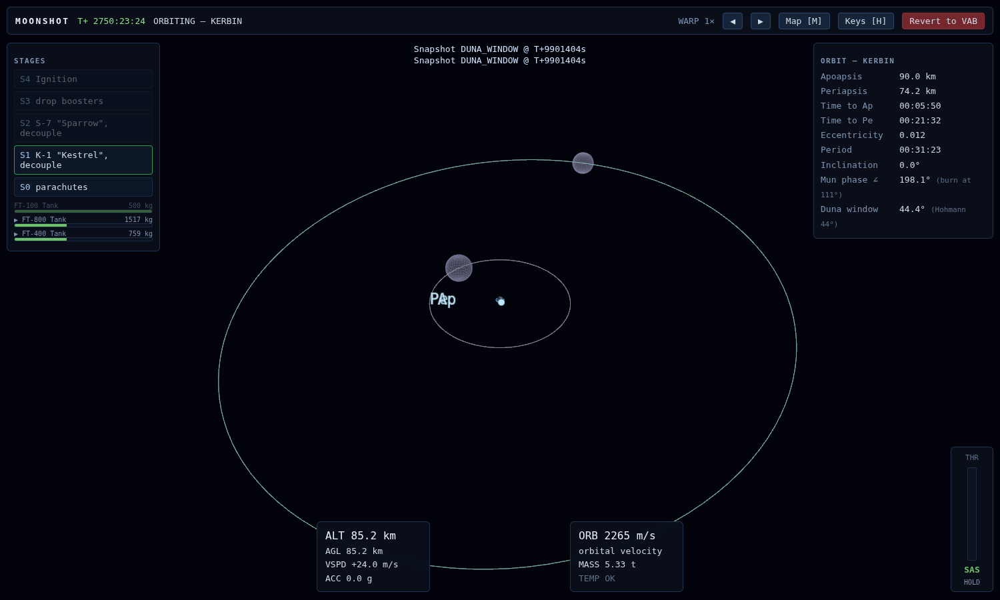
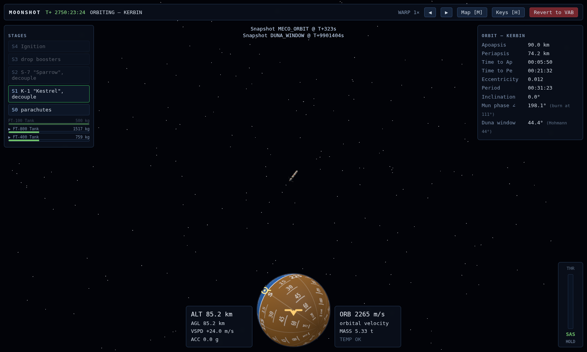
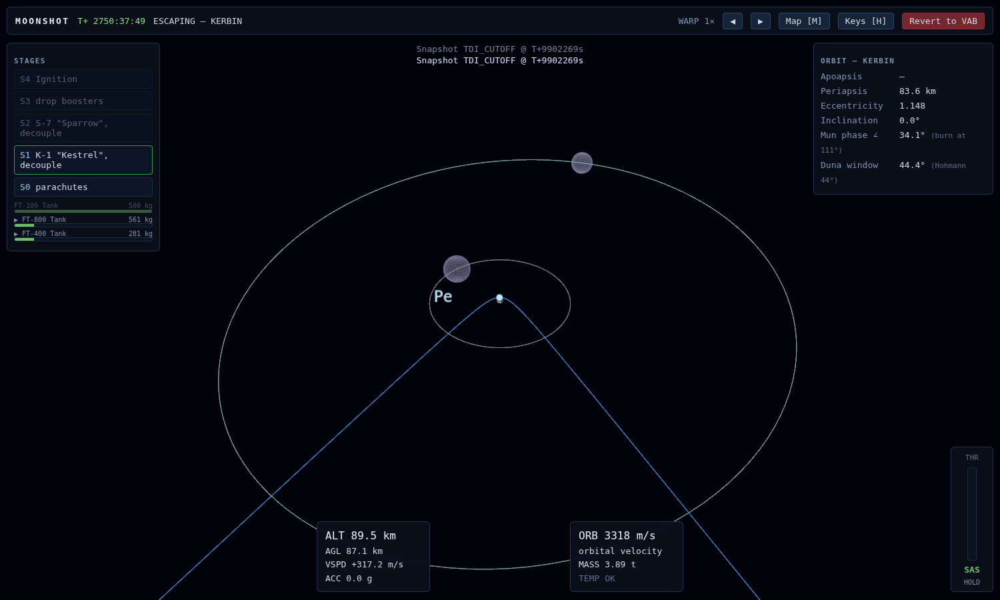
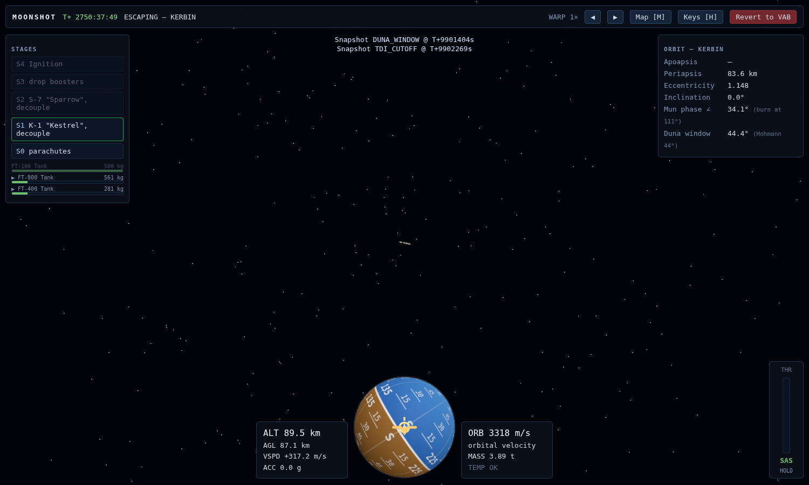
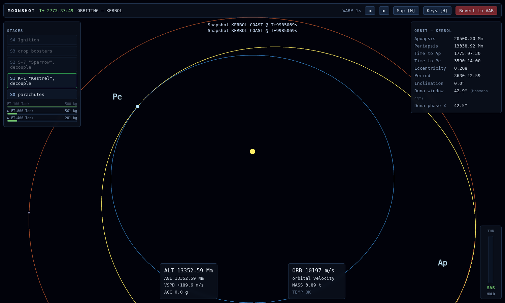
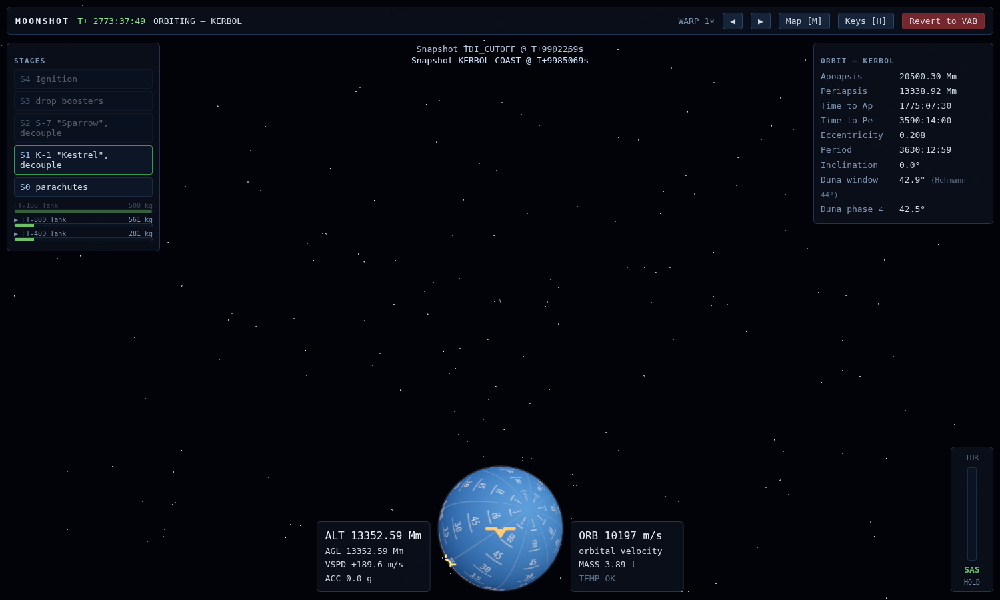
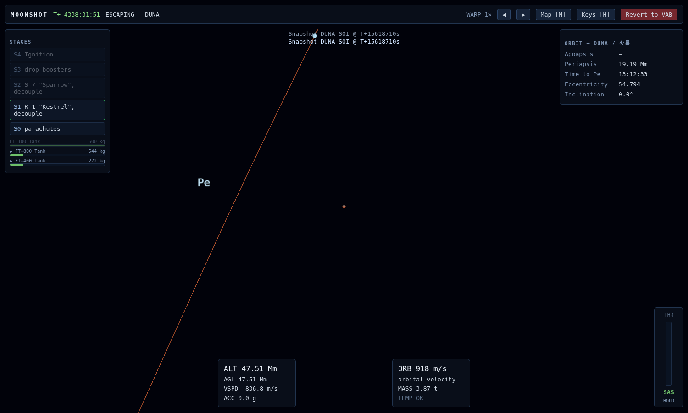
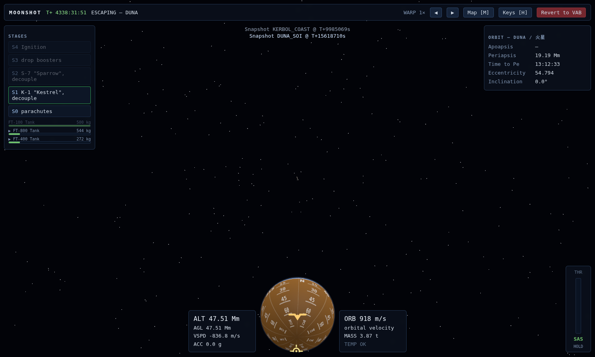
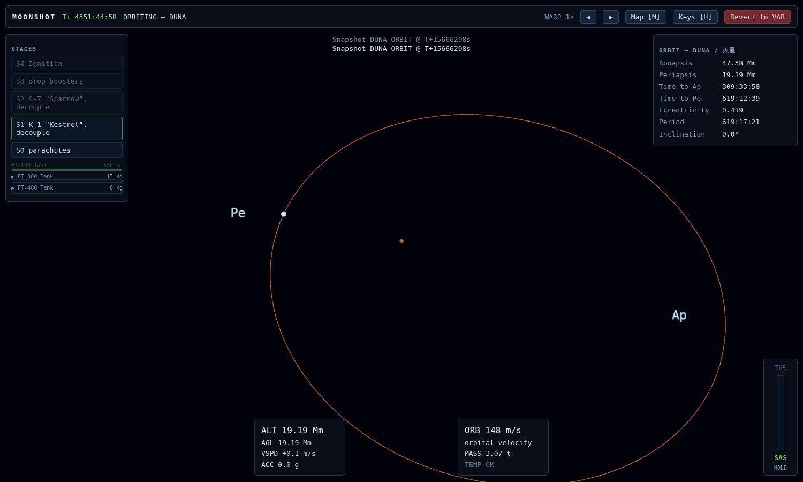
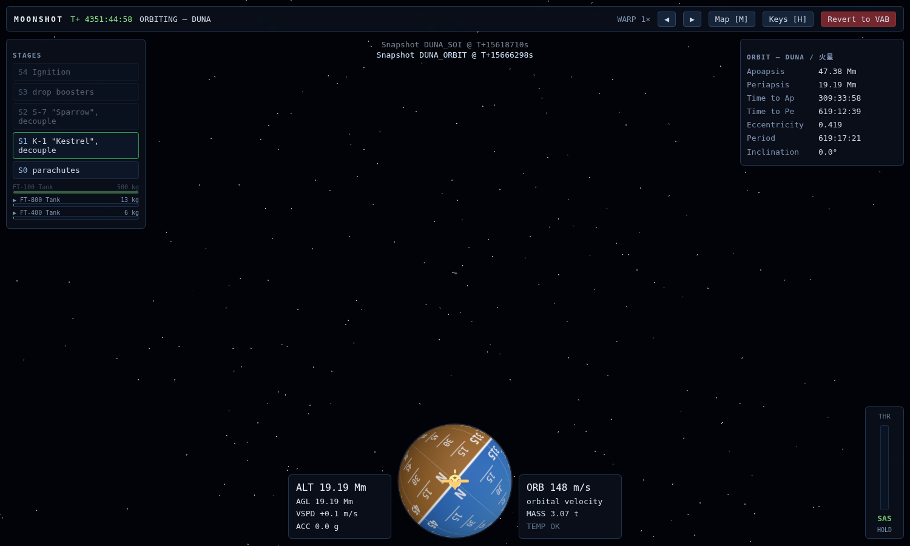

# MOONSHOT — Kerbin → Duna / 火星 Hohmann

**Craft:** Mun Express (stock) · **Pilot:** autopilot (`mcp/duna-hohmann.mjs`) · **Physics:** live game engine, headless (`SimSession`)
**Result:** captured at Duna / 火星  19188 × 47378 km · LKO 74 × 90 km · fuel 519 kg

## Key orbits

- **Hohmann (Kerbin→Duna):** tT=75.51 d  phase=44.36°  v∞dep=918 m/s  v∞arr=826 m/s
- **LKO:** 74 × 90 km
- **Duna window:** now 44.40°  target 44.36°  err 0.04°  waited 114.60 d
- **TDI:** 84 × ∞ km  v∞=874 m/s (tgt 918)  Δfuel 1434 kg  burn 81 s
- **Kerbol SOI:** reached
- **Duna / 火星 SOI:** reached
- **Duna orbit:** 19188 × 47378 km
- **Fuel remaining:** 519 kg
- **Snapshots:** PRELAUNCH, MECO_ORBIT, DUNA_WINDOW, TDI_CUTOFF, KERBOL_COAST, DUNA_SOI, DUNA_ORBIT
- **Retries / mid-course:** prograde 11.0 m/s → Duna Pe 20824 km

## Events

```text
T+00:00:00   PRELAUNCH     Mun Express on the pad — liftoff mass 32.43 t, 5 stages
T+00:00:00   STAGE 1       Ignition — ignite F-30 "Falcon" + SRB-30 Booster (ignition)
T+00:00:00   LIFTOFF       Vehicle has cleared the pad
T+00:00:30   STAGE 2       Drop boosters — boosters away (SRBs dry)
T+00:01:53   STAGE 3       Decouple + ignite — ignite S-7 "Sparrow", lower stack jettisoned (stage dry)
T+00:05:23   MECO / ORBIT  Stable orbit 74 × 90 km
T+00:05:23   DUNA WINDOW   Target phase 44.36°  now 225.83°  wait 114.62 d  (tT 75.51 d, v∞ 918/826 m/s)
T+2750:23:23 DUNA WINDOW   Phase matched — now 44.40° vs target 44.36° (err 0.04°)
T+2750:37:48 TDI           Trans-Duna injection — 84 × ∞ km  v∞=874 m/s (tgt 918)  Δfuel 1434 kg  burn 81 s
T+2773:37:48 SOI           Entered Kerbol sphere of influence
T+2773:37:48 KERBOL SOI    Left Kerbin SOI — solar Hohmann  13338922 × 20500299 km
T+2773:37:48 MID-COURSE    prograde 11.0 m/s → Duna Pe 20824 km
T+2773:37:50 ENCOUNTER     Duna Pe 19187 km  SOI in 1564:52:12 (65.20 d)
T+4338:31:50 SOI           Entered Duna / 火星 sphere of influence
T+4338:31:50 DUNA SOI      Entered Duna / 火星 SOI — 19188 × ∞ km  fuel 1315 kg
T+4351:44:57 DOI / MOI     Duna capture — 19188 × 47378 km  Δfuel 796 kg  fuel 519 kg
```

## Screenshots

In-game captures from the live Three.js flight view (snapshot replay).

### Pad / 发射台 — Mun Express on Kerbin


### LKO map — Kerbin / Mun / Minmus


### LKO after MECO — 近地轨道


### Duna window map — 即将点火



### Duna window — 霍曼窗口 (phase matched)



### TDI map — 双曲线逃逸



### TDI cutoff — 逃逸点火结束 (Kerbin SOI)



### Solar Hohmann — Kerbin (blue) / Duna (orange) / transfer ellipse



### 霍曼转移 — Kerbol 图，Kerbin 蓝圈 / Duna 橙圈



### Duna SOI map



### Duna SOI — 进入火星（Duna）引力球



### Duna orbit map — bound, Ap < SOI



### Duna orbit — 捕获环绕 Duna / 火星



## Telemetry

Sampled every 15 s under thrust, every 15 min on coasts.

| MET | Body | Altitude | Velocity | Mass | Liquid fuel | Throttle | notes |
|---|---|--:|--:|--:|--:|--:|---|
| T+00:00:00 | Kerbin | 57 m | 0 m/s | 32.43 t | 14500 kg | 0% | pad |
| T+00:05:23 | Kerbin | 89.1 km | 2252 m/s | 5.33 t | 2776 kg | 0% | LKO |
| T+06:12:03 | Kerbin | 75.9 km | 2296 m/s | 5.33 t | 2776 kg | 0% |  |
| T+12:18:43 | Kerbin | 80.3 km | 2281 m/s | 5.33 t | 2776 kg | 0% |  |
| T+18:25:23 | Kerbin | 89.8 km | 2250 m/s | 5.33 t | 2776 kg | 0% |  |
| T+24:32:03 | Kerbin | 77.5 km | 2291 m/s | 5.33 t | 2776 kg | 0% |  |
| T+30:38:43 | Kerbin | 78.4 km | 2288 m/s | 5.33 t | 2776 kg | 0% |  |
| T+36:45:23 | Kerbin | 90.0 km | 2249 m/s | 5.33 t | 2776 kg | 0% |  |
| T+42:52:03 | Kerbin | 79.3 km | 2285 m/s | 5.33 t | 2776 kg | 0% |  |
| T+48:58:43 | Kerbin | 76.7 km | 2294 m/s | 5.33 t | 2776 kg | 0% |  |
| T+55:05:23 | Kerbin | 89.6 km | 2251 m/s | 5.33 t | 2776 kg | 0% |  |
| T+61:12:03 | Kerbin | 81.3 km | 2278 m/s | 5.33 t | 2776 kg | 0% |  |
| T+67:18:43 | Kerbin | 75.4 km | 2298 m/s | 5.33 t | 2776 kg | 0% |  |
| T+73:25:23 | Kerbin | 88.7 km | 2254 m/s | 5.33 t | 2776 kg | 0% |  |
| T+79:32:03 | Kerbin | 83.4 km | 2271 m/s | 5.33 t | 2776 kg | 0% |  |
| T+85:38:43 | Kerbin | 74.5 km | 2301 m/s | 5.33 t | 2776 kg | 0% |  |
| T+91:45:23 | Kerbin | 87.3 km | 2258 m/s | 5.33 t | 2776 kg | 0% |  |
| T+97:52:03 | Kerbin | 85.4 km | 2264 m/s | 5.33 t | 2776 kg | 0% |  |
| T+103:58:43 | Kerbin | 74.2 km | 2302 m/s | 5.33 t | 2776 kg | 0% |  |
| T+110:05:23 | Kerbin | 85.6 km | 2264 m/s | 5.33 t | 2776 kg | 0% |  |
| T+116:12:03 | Kerbin | 87.1 km | 2259 m/s | 5.33 t | 2776 kg | 0% |  |
| T+122:18:43 | Kerbin | 74.5 km | 2301 m/s | 5.33 t | 2776 kg | 0% |  |
| T+128:25:23 | Kerbin | 83.6 km | 2270 m/s | 5.33 t | 2776 kg | 0% |  |
| T+134:32:03 | Kerbin | 88.5 km | 2254 m/s | 5.33 t | 2776 kg | 0% |  |
| T+140:38:43 | Kerbin | 75.3 km | 2298 m/s | 5.33 t | 2776 kg | 0% |  |
| T+146:45:23 | Kerbin | 81.6 km | 2277 m/s | 5.33 t | 2776 kg | 0% |  |
| T+152:52:03 | Kerbin | 89.5 km | 2251 m/s | 5.33 t | 2776 kg | 0% |  |
| T+158:58:43 | Kerbin | 76.5 km | 2294 m/s | 5.33 t | 2776 kg | 0% |  |
| T+165:05:23 | Kerbin | 79.5 km | 2284 m/s | 5.33 t | 2776 kg | 0% |  |
| T+171:12:03 | Kerbin | 89.9 km | 2249 m/s | 5.33 t | 2776 kg | 0% |  |
| T+177:18:43 | Kerbin | 78.2 km | 2288 m/s | 5.33 t | 2776 kg | 0% |  |
| T+183:25:23 | Kerbin | 77.6 km | 2290 m/s | 5.33 t | 2776 kg | 0% |  |
| T+189:32:03 | Kerbin | 89.9 km | 2250 m/s | 5.33 t | 2776 kg | 0% |  |
| T+195:38:43 | Kerbin | 80.1 km | 2282 m/s | 5.33 t | 2776 kg | 0% |  |
| T+201:45:23 | Kerbin | 76.1 km | 2296 m/s | 5.33 t | 2776 kg | 0% |  |
| T+207:52:03 | Kerbin | 89.2 km | 2252 m/s | 5.33 t | 2776 kg | 0% |  |
| T+213:58:43 | Kerbin | 82.2 km | 2275 m/s | 5.33 t | 2776 kg | 0% |  |
| T+220:05:23 | Kerbin | 75.0 km | 2299 m/s | 5.33 t | 2776 kg | 0% |  |
| T+226:12:03 | Kerbin | 88.1 km | 2255 m/s | 5.33 t | 2776 kg | 0% |  |
| T+232:18:43 | Kerbin | 84.2 km | 2268 m/s | 5.33 t | 2776 kg | 0% |  |
| T+238:25:23 | Kerbin | 74.3 km | 2301 m/s | 5.33 t | 2776 kg | 0% |  |
| T+244:32:03 | Kerbin | 86.6 km | 2260 m/s | 5.33 t | 2776 kg | 0% |  |
| T+250:38:43 | Kerbin | 86.1 km | 2262 m/s | 5.33 t | 2776 kg | 0% |  |
| T+256:45:23 | Kerbin | 74.2 km | 2302 m/s | 5.33 t | 2776 kg | 0% |  |
| T+262:52:03 | Kerbin | 84.8 km | 2266 m/s | 5.33 t | 2776 kg | 0% |  |
| T+268:58:43 | Kerbin | 87.8 km | 2257 m/s | 5.33 t | 2776 kg | 0% |  |
| T+275:05:23 | Kerbin | 74.7 km | 2300 m/s | 5.33 t | 2776 kg | 0% |  |
| T+281:12:03 | Kerbin | 82.8 km | 2273 m/s | 5.33 t | 2776 kg | 0% |  |
| T+287:18:43 | Kerbin | 89.0 km | 2253 m/s | 5.33 t | 2776 kg | 0% |  |
| T+293:25:23 | Kerbin | 75.7 km | 2297 m/s | 5.33 t | 2776 kg | 0% |  |
| T+299:32:03 | Kerbin | 80.7 km | 2280 m/s | 5.33 t | 2776 kg | 0% |  |
| T+305:38:43 | Kerbin | 89.7 km | 2250 m/s | 5.33 t | 2776 kg | 0% |  |
| T+311:45:23 | Kerbin | 77.2 km | 2292 m/s | 5.33 t | 2776 kg | 0% |  |
| T+317:52:03 | Kerbin | 78.7 km | 2287 m/s | 5.33 t | 2776 kg | 0% |  |
| T+323:58:43 | Kerbin | 90.0 km | 2249 m/s | 5.33 t | 2776 kg | 0% |  |
| T+330:05:23 | Kerbin | 79.0 km | 2286 m/s | 5.33 t | 2776 kg | 0% |  |
| T+336:12:03 | Kerbin | 77.0 km | 2293 m/s | 5.33 t | 2776 kg | 0% |  |
| T+342:18:43 | Kerbin | 89.7 km | 2250 m/s | 5.33 t | 2776 kg | 0% |  |
| T+348:25:23 | Kerbin | 81.0 km | 2279 m/s | 5.33 t | 2776 kg | 0% |  |
| T+354:32:03 | Kerbin | 75.6 km | 2297 m/s | 5.33 t | 2776 kg | 0% |  |
| T+360:38:43 | Kerbin | 88.8 km | 2253 m/s | 5.33 t | 2776 kg | 0% |  |
| T+366:45:23 | Kerbin | 83.1 km | 2272 m/s | 5.33 t | 2776 kg | 0% |  |
| T+372:52:03 | Kerbin | 74.6 km | 2300 m/s | 5.33 t | 2776 kg | 0% |  |
| T+378:58:43 | Kerbin | 87.6 km | 2257 m/s | 5.33 t | 2776 kg | 0% |  |
| T+385:05:23 | Kerbin | 85.1 km | 2266 m/s | 5.33 t | 2776 kg | 0% |  |
| T+391:12:03 | Kerbin | 74.2 km | 2302 m/s | 5.33 t | 2776 kg | 0% |  |
| T+397:18:43 | Kerbin | 85.9 km | 2263 m/s | 5.33 t | 2776 kg | 0% |  |
| T+403:25:23 | Kerbin | 86.9 km | 2260 m/s | 5.33 t | 2776 kg | 0% |  |
| T+409:32:03 | Kerbin | 74.4 km | 2301 m/s | 5.33 t | 2776 kg | 0% |  |
| T+415:38:43 | Kerbin | 84.0 km | 2269 m/s | 5.33 t | 2776 kg | 0% |  |
| T+421:45:23 | Kerbin | 88.3 km | 2255 m/s | 5.33 t | 2776 kg | 0% |  |
| T+427:52:03 | Kerbin | 75.1 km | 2299 m/s | 5.33 t | 2776 kg | 0% |  |
| T+433:58:43 | Kerbin | 81.9 km | 2276 m/s | 5.33 t | 2776 kg | 0% |  |
| T+440:05:23 | Kerbin | 89.4 km | 2251 m/s | 5.33 t | 2776 kg | 0% |  |
| T+446:12:03 | Kerbin | 76.3 km | 2295 m/s | 5.33 t | 2776 kg | 0% |  |
| T+452:18:43 | Kerbin | 79.9 km | 2283 m/s | 5.33 t | 2776 kg | 0% |  |
| T+458:25:23 | Kerbin | 89.9 km | 2250 m/s | 5.33 t | 2776 kg | 0% |  |
| T+464:32:03 | Kerbin | 77.9 km | 2290 m/s | 5.33 t | 2776 kg | 0% |  |
| T+470:38:43 | Kerbin | 77.9 km | 2289 m/s | 5.33 t | 2776 kg | 0% |  |
| T+476:45:23 | Kerbin | 89.9 km | 2250 m/s | 5.33 t | 2776 kg | 0% |  |
| T+482:52:03 | Kerbin | 79.8 km | 2283 m/s | 5.33 t | 2776 kg | 0% |  |
| T+488:58:43 | Kerbin | 76.3 km | 2295 m/s | 5.33 t | 2776 kg | 0% |  |
| T+495:05:23 | Kerbin | 89.4 km | 2251 m/s | 5.33 t | 2776 kg | 0% |  |
| T+501:12:03 | Kerbin | 81.8 km | 2276 m/s | 5.33 t | 2776 kg | 0% |  |
| T+507:18:43 | Kerbin | 75.1 km | 2299 m/s | 5.33 t | 2776 kg | 0% |  |
| T+513:25:23 | Kerbin | 88.4 km | 2255 m/s | 5.33 t | 2776 kg | 0% |  |
| T+519:32:03 | Kerbin | 83.9 km | 2269 m/s | 5.33 t | 2776 kg | 0% |  |
| T+525:38:43 | Kerbin | 74.4 km | 2301 m/s | 5.33 t | 2776 kg | 0% |  |
| T+531:45:23 | Kerbin | 86.9 km | 2259 m/s | 5.33 t | 2776 kg | 0% |  |
| T+537:52:03 | Kerbin | 85.8 km | 2263 m/s | 5.33 t | 2776 kg | 0% |  |
| T+543:58:43 | Kerbin | 74.2 km | 2302 m/s | 5.33 t | 2776 kg | 0% |  |
| T+550:05:23 | Kerbin | 85.1 km | 2265 m/s | 5.33 t | 2776 kg | 0% |  |
| T+556:12:03 | Kerbin | 87.5 km | 2257 m/s | 5.33 t | 2776 kg | 0% |  |
| T+562:18:43 | Kerbin | 74.6 km | 2301 m/s | 5.33 t | 2776 kg | 0% |  |
| T+568:25:23 | Kerbin | 83.1 km | 2272 m/s | 5.33 t | 2776 kg | 0% |  |
| T+574:32:03 | Kerbin | 88.8 km | 2253 m/s | 5.33 t | 2776 kg | 0% |  |
| T+580:38:43 | Kerbin | 75.5 km | 2297 m/s | 5.33 t | 2776 kg | 0% |  |
| T+586:45:23 | Kerbin | 81.0 km | 2279 m/s | 5.33 t | 2776 kg | 0% |  |
| T+592:52:03 | Kerbin | 89.6 km | 2250 m/s | 5.33 t | 2776 kg | 0% |  |
| T+598:58:43 | Kerbin | 76.9 km | 2293 m/s | 5.33 t | 2776 kg | 0% |  |
| T+605:05:23 | Kerbin | 79.0 km | 2286 m/s | 5.33 t | 2776 kg | 0% |  |
| T+611:12:03 | Kerbin | 90.0 km | 2249 m/s | 5.33 t | 2776 kg | 0% |  |
| T+617:18:43 | Kerbin | 78.6 km | 2287 m/s | 5.33 t | 2776 kg | 0% |  |
| T+623:25:23 | Kerbin | 77.2 km | 2292 m/s | 5.33 t | 2776 kg | 0% |  |
| T+629:32:03 | Kerbin | 89.8 km | 2250 m/s | 5.33 t | 2776 kg | 0% |  |
| T+635:38:43 | Kerbin | 80.6 km | 2280 m/s | 5.33 t | 2776 kg | 0% |  |
| T+641:45:23 | Kerbin | 75.8 km | 2297 m/s | 5.33 t | 2776 kg | 0% |  |
| T+647:52:03 | Kerbin | 89.0 km | 2252 m/s | 5.33 t | 2776 kg | 0% |  |
| T+653:58:43 | Kerbin | 82.7 km | 2273 m/s | 5.33 t | 2776 kg | 0% |  |
| T+660:05:23 | Kerbin | 74.8 km | 2300 m/s | 5.33 t | 2776 kg | 0% |  |
| T+666:12:03 | Kerbin | 87.8 km | 2256 m/s | 5.33 t | 2776 kg | 0% |  |
| T+672:18:43 | Kerbin | 84.7 km | 2267 m/s | 5.33 t | 2776 kg | 0% |  |
| T+678:25:23 | Kerbin | 74.3 km | 2302 m/s | 5.33 t | 2776 kg | 0% |  |
| T+684:32:03 | Kerbin | 86.2 km | 2262 m/s | 5.33 t | 2776 kg | 0% |  |
| T+690:38:43 | Kerbin | 86.6 km | 2261 m/s | 5.33 t | 2776 kg | 0% |  |
| T+696:45:23 | Kerbin | 74.3 km | 2302 m/s | 5.33 t | 2776 kg | 0% |  |
| T+702:52:03 | Kerbin | 84.3 km | 2268 m/s | 5.33 t | 2776 kg | 0% |  |
| T+708:58:43 | Kerbin | 88.1 km | 2255 m/s | 5.33 t | 2776 kg | 0% |  |
| T+715:05:23 | Kerbin | 74.9 km | 2299 m/s | 5.33 t | 2776 kg | 0% |  |
| T+721:12:03 | Kerbin | 82.3 km | 2275 m/s | 5.33 t | 2776 kg | 0% |  |
| T+727:18:43 | Kerbin | 89.2 km | 2252 m/s | 5.33 t | 2776 kg | 0% |  |
| T+733:25:23 | Kerbin | 76.0 km | 2296 m/s | 5.33 t | 2776 kg | 0% |  |
| T+739:32:03 | Kerbin | 80.2 km | 2282 m/s | 5.33 t | 2776 kg | 0% |  |
| T+745:38:43 | Kerbin | 89.8 km | 2250 m/s | 5.33 t | 2776 kg | 0% |  |
| T+751:45:23 | Kerbin | 77.6 km | 2291 m/s | 5.33 t | 2776 kg | 0% |  |
| T+757:52:03 | Kerbin | 78.3 km | 2288 m/s | 5.33 t | 2776 kg | 0% |  |
| T+763:58:43 | Kerbin | 89.9 km | 2249 m/s | 5.33 t | 2776 kg | 0% |  |
| T+770:05:23 | Kerbin | 79.4 km | 2284 m/s | 5.33 t | 2776 kg | 0% |  |
| T+776:12:03 | Kerbin | 76.6 km | 2294 m/s | 5.33 t | 2776 kg | 0% |  |
| T+782:18:43 | Kerbin | 89.5 km | 2251 m/s | 5.33 t | 2776 kg | 0% |  |
| T+788:25:23 | Kerbin | 81.5 km | 2277 m/s | 5.33 t | 2776 kg | 0% |  |
| T+794:32:03 | Kerbin | 75.3 km | 2298 m/s | 5.33 t | 2776 kg | 0% |  |
| T+800:38:43 | Kerbin | 88.6 km | 2254 m/s | 5.33 t | 2776 kg | 0% |  |
| T+806:45:23 | Kerbin | 83.6 km | 2271 m/s | 5.33 t | 2776 kg | 0% |  |
| T+812:52:03 | Kerbin | 74.5 km | 2301 m/s | 5.33 t | 2776 kg | 0% |  |
| T+818:58:43 | Kerbin | 87.2 km | 2258 m/s | 5.33 t | 2776 kg | 0% |  |
| T+825:05:23 | Kerbin | 85.5 km | 2264 m/s | 5.33 t | 2776 kg | 0% |  |
| T+831:12:03 | Kerbin | 74.2 km | 2302 m/s | 5.33 t | 2776 kg | 0% |  |
| T+837:18:43 | Kerbin | 85.4 km | 2264 m/s | 5.33 t | 2776 kg | 0% |  |
| T+843:25:23 | Kerbin | 87.2 km | 2258 m/s | 5.33 t | 2776 kg | 0% |  |
| T+849:32:03 | Kerbin | 74.5 km | 2301 m/s | 5.33 t | 2776 kg | 0% |  |
| T+855:38:43 | Kerbin | 83.5 km | 2271 m/s | 5.33 t | 2776 kg | 0% |  |
| T+861:45:23 | Kerbin | 88.6 km | 2254 m/s | 5.33 t | 2776 kg | 0% |  |
| T+867:52:03 | Kerbin | 75.3 km | 2298 m/s | 5.33 t | 2776 kg | 0% |  |
| T+873:58:43 | Kerbin | 81.4 km | 2278 m/s | 5.33 t | 2776 kg | 0% |  |
| T+880:05:23 | Kerbin | 89.5 km | 2251 m/s | 5.33 t | 2776 kg | 0% |  |
| T+886:12:03 | Kerbin | 76.6 km | 2294 m/s | 5.33 t | 2776 kg | 0% |  |
| T+892:18:43 | Kerbin | 79.4 km | 2285 m/s | 5.33 t | 2776 kg | 0% |  |
| T+898:25:23 | Kerbin | 89.9 km | 2249 m/s | 5.33 t | 2776 kg | 0% |  |
| T+904:32:03 | Kerbin | 78.3 km | 2288 m/s | 5.33 t | 2776 kg | 0% |  |
| T+910:38:43 | Kerbin | 77.5 km | 2291 m/s | 5.33 t | 2776 kg | 0% |  |
| T+916:45:23 | Kerbin | 89.8 km | 2250 m/s | 5.33 t | 2776 kg | 0% |  |
| T+922:52:03 | Kerbin | 80.3 km | 2282 m/s | 5.33 t | 2776 kg | 0% |  |
| T+928:58:43 | Kerbin | 76.0 km | 2296 m/s | 5.33 t | 2776 kg | 0% |  |
| T+935:05:23 | Kerbin | 89.2 km | 2252 m/s | 5.33 t | 2776 kg | 0% |  |
| T+941:12:03 | Kerbin | 82.3 km | 2275 m/s | 5.33 t | 2776 kg | 0% |  |
| T+947:18:43 | Kerbin | 74.9 km | 2300 m/s | 5.33 t | 2776 kg | 0% |  |
| T+953:25:23 | Kerbin | 88.0 km | 2256 m/s | 5.33 t | 2776 kg | 0% |  |
| T+959:32:03 | Kerbin | 84.4 km | 2268 m/s | 5.33 t | 2776 kg | 0% |  |
| T+965:38:43 | Kerbin | 74.3 km | 2302 m/s | 5.33 t | 2776 kg | 0% |  |
| T+971:45:23 | Kerbin | 86.5 km | 2261 m/s | 5.33 t | 2776 kg | 0% |  |
| T+977:52:03 | Kerbin | 86.3 km | 2262 m/s | 5.33 t | 2776 kg | 0% |  |
| T+983:58:43 | Kerbin | 74.3 km | 2302 m/s | 5.33 t | 2776 kg | 0% |  |
| T+990:05:23 | Kerbin | 84.7 km | 2267 m/s | 5.33 t | 2776 kg | 0% |  |
| T+996:12:03 | Kerbin | 87.9 km | 2256 m/s | 5.33 t | 2776 kg | 0% |  |
| T+1002:18:43 | Kerbin | 74.8 km | 2300 m/s | 5.33 t | 2776 kg | 0% |  |
| T+1008:25:23 | Kerbin | 82.6 km | 2274 m/s | 5.33 t | 2776 kg | 0% |  |
| T+1014:32:03 | Kerbin | 89.1 km | 2252 m/s | 5.33 t | 2776 kg | 0% |  |
| T+1020:38:43 | Kerbin | 75.8 km | 2296 m/s | 5.33 t | 2776 kg | 0% |  |
| T+1026:45:23 | Kerbin | 80.5 km | 2281 m/s | 5.33 t | 2776 kg | 0% |  |
| T+1032:52:03 | Kerbin | 89.8 km | 2250 m/s | 5.33 t | 2776 kg | 0% |  |
| T+1038:58:43 | Kerbin | 77.3 km | 2291 m/s | 5.33 t | 2776 kg | 0% |  |
| T+1045:05:23 | Kerbin | 78.6 km | 2287 m/s | 5.33 t | 2776 kg | 0% |  |
| T+1051:12:03 | Kerbin | 90.0 km | 2249 m/s | 5.33 t | 2776 kg | 0% |  |
| T+1057:18:43 | Kerbin | 79.1 km | 2285 m/s | 5.33 t | 2776 kg | 0% |  |
| T+1063:25:23 | Kerbin | 76.8 km | 2293 m/s | 5.33 t | 2776 kg | 0% |  |
| T+1069:32:03 | Kerbin | 89.6 km | 2250 m/s | 5.33 t | 2776 kg | 0% |  |
| T+1075:38:43 | Kerbin | 81.1 km | 2279 m/s | 5.33 t | 2776 kg | 0% |  |
| T+1081:45:23 | Kerbin | 75.5 km | 2298 m/s | 5.33 t | 2776 kg | 0% |  |
| T+1087:52:03 | Kerbin | 88.8 km | 2253 m/s | 5.33 t | 2776 kg | 0% |  |
| T+1093:58:43 | Kerbin | 83.2 km | 2272 m/s | 5.33 t | 2776 kg | 0% |  |
| T+1100:05:23 | Kerbin | 74.6 km | 2301 m/s | 5.33 t | 2776 kg | 0% |  |
| T+1106:12:03 | Kerbin | 87.5 km | 2258 m/s | 5.33 t | 2776 kg | 0% |  |
| T+1112:18:43 | Kerbin | 85.2 km | 2265 m/s | 5.33 t | 2776 kg | 0% |  |
| T+1118:25:23 | Kerbin | 74.2 km | 2302 m/s | 5.33 t | 2776 kg | 0% |  |
| T+1124:32:03 | Kerbin | 85.8 km | 2263 m/s | 5.33 t | 2776 kg | 0% |  |
| T+1130:38:43 | Kerbin | 87.0 km | 2259 m/s | 5.33 t | 2776 kg | 0% |  |
| T+1136:45:23 | Kerbin | 74.4 km | 2301 m/s | 5.33 t | 2776 kg | 0% |  |
| T+1142:52:03 | Kerbin | 83.8 km | 2270 m/s | 5.33 t | 2776 kg | 0% |  |
| T+1148:58:43 | Kerbin | 88.4 km | 2254 m/s | 5.33 t | 2776 kg | 0% |  |
| T+1155:05:23 | Kerbin | 75.1 km | 2299 m/s | 5.33 t | 2776 kg | 0% |  |
| T+1161:12:03 | Kerbin | 81.8 km | 2277 m/s | 5.33 t | 2776 kg | 0% |  |
| T+1167:18:43 | Kerbin | 89.4 km | 2251 m/s | 5.33 t | 2776 kg | 0% |  |
| T+1173:25:23 | Kerbin | 76.4 km | 2295 m/s | 5.33 t | 2776 kg | 0% |  |
| T+1179:32:03 | Kerbin | 79.7 km | 2283 m/s | 5.33 t | 2776 kg | 0% |  |
| T+1185:38:43 | Kerbin | 89.9 km | 2249 m/s | 5.33 t | 2776 kg | 0% |  |
| T+1191:45:23 | Kerbin | 78.0 km | 2289 m/s | 5.33 t | 2776 kg | 0% |  |
| T+1197:52:03 | Kerbin | 77.8 km | 2290 m/s | 5.33 t | 2776 kg | 0% |  |
| T+1203:58:43 | Kerbin | 89.9 km | 2250 m/s | 5.33 t | 2776 kg | 0% |  |
| T+1210:05:23 | Kerbin | 79.9 km | 2283 m/s | 5.33 t | 2776 kg | 0% |  |
| T+1216:12:03 | Kerbin | 76.2 km | 2295 m/s | 5.33 t | 2776 kg | 0% |  |
| T+1222:18:43 | Kerbin | 89.3 km | 2251 m/s | 5.33 t | 2776 kg | 0% |  |
| T+1228:25:23 | Kerbin | 82.0 km | 2276 m/s | 5.33 t | 2776 kg | 0% |  |
| T+1234:32:03 | Kerbin | 75.0 km | 2299 m/s | 5.33 t | 2776 kg | 0% |  |
| T+1240:38:43 | Kerbin | 88.3 km | 2255 m/s | 5.33 t | 2776 kg | 0% |  |
| T+1246:45:23 | Kerbin | 84.0 km | 2269 m/s | 5.33 t | 2776 kg | 0% |  |
| T+1252:52:03 | Kerbin | 74.4 km | 2301 m/s | 5.33 t | 2776 kg | 0% |  |
| T+1258:58:43 | Kerbin | 86.8 km | 2260 m/s | 5.33 t | 2776 kg | 0% |  |
| T+1265:05:23 | Kerbin | 86.0 km | 2263 m/s | 5.33 t | 2776 kg | 0% |  |
| T+1271:12:03 | Kerbin | 74.2 km | 2302 m/s | 5.33 t | 2776 kg | 0% |  |
| T+1277:18:43 | Kerbin | 85.0 km | 2266 m/s | 5.33 t | 2776 kg | 0% |  |
| T+1283:25:23 | Kerbin | 87.6 km | 2257 m/s | 5.33 t | 2776 kg | 0% |  |
| T+1289:32:03 | Kerbin | 74.7 km | 2300 m/s | 5.33 t | 2776 kg | 0% |  |
| T+1295:38:43 | Kerbin | 83.0 km | 2272 m/s | 5.33 t | 2776 kg | 0% |  |
| T+1301:45:23 | Kerbin | 88.9 km | 2253 m/s | 5.33 t | 2776 kg | 0% |  |
| T+1307:52:03 | Kerbin | 75.6 km | 2297 m/s | 5.33 t | 2776 kg | 0% |  |
| T+1313:58:43 | Kerbin | 80.9 km | 2279 m/s | 5.33 t | 2776 kg | 0% |  |
| T+1320:05:23 | Kerbin | 89.7 km | 2250 m/s | 5.33 t | 2776 kg | 0% |  |
| T+1326:12:03 | Kerbin | 77.0 km | 2292 m/s | 5.33 t | 2776 kg | 0% |  |
| T+1332:18:43 | Kerbin | 78.9 km | 2286 m/s | 5.33 t | 2776 kg | 0% |  |
| T+1338:25:23 | Kerbin | 90.0 km | 2249 m/s | 5.33 t | 2776 kg | 0% |  |
| T+1344:32:03 | Kerbin | 78.8 km | 2287 m/s | 5.33 t | 2776 kg | 0% |  |
| T+1350:38:43 | Kerbin | 77.1 km | 2292 m/s | 5.33 t | 2776 kg | 0% |  |
| T+1356:45:23 | Kerbin | 89.7 km | 2250 m/s | 5.33 t | 2776 kg | 0% |  |
| T+1362:52:03 | Kerbin | 80.8 km | 2280 m/s | 5.33 t | 2776 kg | 0% |  |
| T+1368:58:43 | Kerbin | 75.7 km | 2297 m/s | 5.33 t | 2776 kg | 0% |  |
| T+1375:05:23 | Kerbin | 88.9 km | 2253 m/s | 5.33 t | 2776 kg | 0% |  |
| T+1381:12:03 | Kerbin | 82.8 km | 2273 m/s | 5.33 t | 2776 kg | 0% |  |
| T+1387:18:43 | Kerbin | 74.7 km | 2300 m/s | 5.33 t | 2776 kg | 0% |  |
| T+1393:25:23 | Kerbin | 87.7 km | 2257 m/s | 5.33 t | 2776 kg | 0% |  |
| T+1399:32:03 | Kerbin | 84.9 km | 2266 m/s | 5.33 t | 2776 kg | 0% |  |
| T+1405:38:43 | Kerbin | 74.2 km | 2302 m/s | 5.33 t | 2776 kg | 0% |  |
| T+1411:45:23 | Kerbin | 86.1 km | 2262 m/s | 5.33 t | 2776 kg | 0% |  |
| T+1417:52:03 | Kerbin | 86.7 km | 2260 m/s | 5.33 t | 2776 kg | 0% |  |
| T+1423:58:43 | Kerbin | 74.3 km | 2301 m/s | 5.33 t | 2776 kg | 0% |  |
| T+1430:05:23 | Kerbin | 84.2 km | 2268 m/s | 5.33 t | 2776 kg | 0% |  |
| T+1436:12:03 | Kerbin | 88.2 km | 2255 m/s | 5.33 t | 2776 kg | 0% |  |
| T+1442:18:43 | Kerbin | 75.0 km | 2299 m/s | 5.33 t | 2776 kg | 0% |  |
| T+1448:25:23 | Kerbin | 82.1 km | 2275 m/s | 5.33 t | 2776 kg | 0% |  |
| T+1454:32:03 | Kerbin | 89.3 km | 2252 m/s | 5.33 t | 2776 kg | 0% |  |
| T+1460:38:43 | Kerbin | 76.1 km | 2295 m/s | 5.33 t | 2776 kg | 0% |  |
| T+1466:45:23 | Kerbin | 80.1 km | 2282 m/s | 5.33 t | 2776 kg | 0% |  |
| T+1472:52:03 | Kerbin | 89.9 km | 2250 m/s | 5.33 t | 2776 kg | 0% |  |
| T+1478:58:43 | Kerbin | 77.7 km | 2290 m/s | 5.33 t | 2776 kg | 0% |  |
| T+1485:05:23 | Kerbin | 78.1 km | 2289 m/s | 5.33 t | 2776 kg | 0% |  |
| T+1491:12:03 | Kerbin | 89.9 km | 2249 m/s | 5.33 t | 2776 kg | 0% |  |
| T+1497:18:43 | Kerbin | 79.6 km | 2284 m/s | 5.33 t | 2776 kg | 0% |  |
| T+1503:25:23 | Kerbin | 76.5 km | 2294 m/s | 5.33 t | 2776 kg | 0% |  |
| T+1509:32:03 | Kerbin | 89.5 km | 2251 m/s | 5.33 t | 2776 kg | 0% |  |
| T+1515:38:43 | Kerbin | 81.6 km | 2277 m/s | 5.33 t | 2776 kg | 0% |  |
| T+1521:45:23 | Kerbin | 75.2 km | 2298 m/s | 5.33 t | 2776 kg | 0% |  |
| T+1527:52:03 | Kerbin | 88.5 km | 2254 m/s | 5.33 t | 2776 kg | 0% |  |
| T+1533:58:43 | Kerbin | 83.7 km | 2270 m/s | 5.33 t | 2776 kg | 0% |  |
| T+1540:05:23 | Kerbin | 74.4 km | 2301 m/s | 5.33 t | 2776 kg | 0% |  |
| T+1546:12:03 | Kerbin | 87.1 km | 2259 m/s | 5.33 t | 2776 kg | 0% |  |
| T+1552:18:43 | Kerbin | 85.7 km | 2264 m/s | 5.33 t | 2776 kg | 0% |  |
| T+1558:25:23 | Kerbin | 74.2 km | 2302 m/s | 5.33 t | 2776 kg | 0% |  |
| T+1564:32:03 | Kerbin | 85.3 km | 2265 m/s | 5.33 t | 2776 kg | 0% |  |
| T+1570:38:43 | Kerbin | 87.4 km | 2258 m/s | 5.33 t | 2776 kg | 0% |  |
| T+1576:45:23 | Kerbin | 74.5 km | 2301 m/s | 5.33 t | 2776 kg | 0% |  |
| T+1582:52:03 | Kerbin | 83.3 km | 2271 m/s | 5.33 t | 2776 kg | 0% |  |
| T+1588:58:43 | Kerbin | 88.7 km | 2254 m/s | 5.33 t | 2776 kg | 0% |  |
| T+1595:05:23 | Kerbin | 75.4 km | 2298 m/s | 5.33 t | 2776 kg | 0% |  |
| T+1601:12:03 | Kerbin | 81.3 km | 2278 m/s | 5.33 t | 2776 kg | 0% |  |
| T+1607:18:43 | Kerbin | 89.6 km | 2251 m/s | 5.33 t | 2776 kg | 0% |  |
| T+1613:25:23 | Kerbin | 76.7 km | 2293 m/s | 5.33 t | 2776 kg | 0% |  |
| T+1619:32:03 | Kerbin | 79.2 km | 2285 m/s | 5.33 t | 2776 kg | 0% |  |
| T+1625:38:43 | Kerbin | 90.0 km | 2249 m/s | 5.33 t | 2776 kg | 0% |  |
| T+1631:45:23 | Kerbin | 78.5 km | 2288 m/s | 5.33 t | 2776 kg | 0% |  |
| T+1637:52:03 | Kerbin | 77.4 km | 2291 m/s | 5.33 t | 2776 kg | 0% |  |
| T+1643:58:43 | Kerbin | 89.8 km | 2250 m/s | 5.33 t | 2776 kg | 0% |  |
| T+1650:05:23 | Kerbin | 80.4 km | 2281 m/s | 5.33 t | 2776 kg | 0% |  |
| T+1656:12:03 | Kerbin | 75.9 km | 2296 m/s | 5.33 t | 2776 kg | 0% |  |
| T+1662:18:43 | Kerbin | 89.1 km | 2252 m/s | 5.33 t | 2776 kg | 0% |  |
| T+1668:25:23 | Kerbin | 82.5 km | 2274 m/s | 5.33 t | 2776 kg | 0% |  |
| T+1674:32:03 | Kerbin | 74.8 km | 2300 m/s | 5.33 t | 2776 kg | 0% |  |
| T+1680:38:43 | Kerbin | 87.9 km | 2256 m/s | 5.33 t | 2776 kg | 0% |  |
| T+1686:45:23 | Kerbin | 84.5 km | 2267 m/s | 5.33 t | 2776 kg | 0% |  |
| T+1692:52:03 | Kerbin | 74.3 km | 2302 m/s | 5.33 t | 2776 kg | 0% |  |
| T+1698:58:43 | Kerbin | 86.4 km | 2261 m/s | 5.33 t | 2776 kg | 0% |  |
| T+1705:05:23 | Kerbin | 86.4 km | 2261 m/s | 5.33 t | 2776 kg | 0% |  |
| T+1711:12:03 | Kerbin | 74.3 km | 2302 m/s | 5.33 t | 2776 kg | 0% |  |
| T+1717:18:43 | Kerbin | 84.5 km | 2267 m/s | 5.33 t | 2776 kg | 0% |  |
| T+1723:25:23 | Kerbin | 88.0 km | 2256 m/s | 5.33 t | 2776 kg | 0% |  |
| T+1729:32:03 | Kerbin | 74.8 km | 2300 m/s | 5.33 t | 2776 kg | 0% |  |
| T+1735:38:43 | Kerbin | 82.5 km | 2274 m/s | 5.33 t | 2776 kg | 0% |  |
| T+1741:45:23 | Kerbin | 89.1 km | 2252 m/s | 5.33 t | 2776 kg | 0% |  |
| T+1747:52:03 | Kerbin | 75.9 km | 2296 m/s | 5.33 t | 2776 kg | 0% |  |
| T+1753:58:43 | Kerbin | 80.4 km | 2281 m/s | 5.33 t | 2776 kg | 0% |  |
| T+1760:05:23 | Kerbin | 89.8 km | 2250 m/s | 5.33 t | 2776 kg | 0% |  |
| T+1766:12:03 | Kerbin | 77.4 km | 2291 m/s | 5.33 t | 2776 kg | 0% |  |
| T+1772:18:43 | Kerbin | 78.4 km | 2288 m/s | 5.33 t | 2776 kg | 0% |  |
| T+1778:25:23 | Kerbin | 90.0 km | 2249 m/s | 5.33 t | 2776 kg | 0% |  |
| T+1784:32:03 | Kerbin | 79.2 km | 2285 m/s | 5.33 t | 2776 kg | 0% |  |
| T+1790:38:43 | Kerbin | 76.7 km | 2293 m/s | 5.33 t | 2776 kg | 0% |  |
| T+1796:45:23 | Kerbin | 89.6 km | 2251 m/s | 5.33 t | 2776 kg | 0% |  |
| T+1802:52:03 | Kerbin | 81.3 km | 2278 m/s | 5.33 t | 2776 kg | 0% |  |
| T+1808:58:43 | Kerbin | 75.4 km | 2298 m/s | 5.33 t | 2776 kg | 0% |  |
| T+1815:05:23 | Kerbin | 88.7 km | 2254 m/s | 5.33 t | 2776 kg | 0% |  |
| T+1821:12:03 | Kerbin | 83.3 km | 2271 m/s | 5.33 t | 2776 kg | 0% |  |
| T+1827:18:43 | Kerbin | 74.5 km | 2301 m/s | 5.33 t | 2776 kg | 0% |  |
| T+1833:25:23 | Kerbin | 87.3 km | 2258 m/s | 5.33 t | 2776 kg | 0% |  |
| T+1839:32:03 | Kerbin | 85.3 km | 2265 m/s | 5.33 t | 2776 kg | 0% |  |
| T+1845:38:43 | Kerbin | 74.2 km | 2302 m/s | 5.33 t | 2776 kg | 0% |  |
| T+1851:45:23 | Kerbin | 85.6 km | 2264 m/s | 5.33 t | 2776 kg | 0% |  |
| T+1857:52:03 | Kerbin | 87.1 km | 2259 m/s | 5.33 t | 2776 kg | 0% |  |
| T+1863:58:43 | Kerbin | 74.4 km | 2301 m/s | 5.33 t | 2776 kg | 0% |  |
| T+1870:05:23 | Kerbin | 83.7 km | 2270 m/s | 5.33 t | 2776 kg | 0% |  |
| T+1876:12:03 | Kerbin | 88.5 km | 2254 m/s | 5.33 t | 2776 kg | 0% |  |
| T+1882:18:43 | Kerbin | 75.2 km | 2298 m/s | 5.33 t | 2776 kg | 0% |  |
| T+1888:25:23 | Kerbin | 81.6 km | 2277 m/s | 5.33 t | 2776 kg | 0% |  |
| T+1894:32:03 | Kerbin | 89.5 km | 2251 m/s | 5.33 t | 2776 kg | 0% |  |
| T+1900:38:43 | Kerbin | 76.5 km | 2294 m/s | 5.33 t | 2776 kg | 0% |  |
| T+1906:45:23 | Kerbin | 79.6 km | 2284 m/s | 5.33 t | 2776 kg | 0% |  |
| T+1912:52:03 | Kerbin | 89.9 km | 2249 m/s | 5.33 t | 2776 kg | 0% |  |
| T+1918:58:43 | Kerbin | 78.1 km | 2289 m/s | 5.33 t | 2776 kg | 0% |  |
| T+1925:05:23 | Kerbin | 77.7 km | 2290 m/s | 5.33 t | 2776 kg | 0% |  |
| T+1931:12:03 | Kerbin | 89.9 km | 2250 m/s | 5.33 t | 2776 kg | 0% |  |
| T+1937:18:43 | Kerbin | 80.1 km | 2282 m/s | 5.33 t | 2776 kg | 0% |  |
| T+1943:25:23 | Kerbin | 76.1 km | 2295 m/s | 5.33 t | 2776 kg | 0% |  |
| T+1949:32:03 | Kerbin | 89.3 km | 2252 m/s | 5.33 t | 2776 kg | 0% |  |
| T+1955:38:43 | Kerbin | 82.1 km | 2275 m/s | 5.33 t | 2776 kg | 0% |  |
| T+1961:45:23 | Kerbin | 75.0 km | 2299 m/s | 5.33 t | 2776 kg | 0% |  |
| T+1967:52:03 | Kerbin | 88.2 km | 2255 m/s | 5.33 t | 2776 kg | 0% |  |
| T+1973:58:43 | Kerbin | 84.2 km | 2268 m/s | 5.33 t | 2776 kg | 0% |  |
| T+1980:05:23 | Kerbin | 74.3 km | 2301 m/s | 5.33 t | 2776 kg | 0% |  |
| T+1986:12:03 | Kerbin | 86.7 km | 2260 m/s | 5.33 t | 2776 kg | 0% |  |
| T+1992:18:43 | Kerbin | 86.1 km | 2262 m/s | 5.33 t | 2776 kg | 0% |  |
| T+1998:25:23 | Kerbin | 74.2 km | 2302 m/s | 5.33 t | 2776 kg | 0% |  |
| T+2004:32:03 | Kerbin | 84.9 km | 2266 m/s | 5.33 t | 2776 kg | 0% |  |
| T+2010:38:43 | Kerbin | 87.7 km | 2257 m/s | 5.33 t | 2776 kg | 0% |  |
| T+2016:45:23 | Kerbin | 74.7 km | 2300 m/s | 5.33 t | 2776 kg | 0% |  |
| T+2022:52:03 | Kerbin | 82.8 km | 2273 m/s | 5.33 t | 2776 kg | 0% |  |
| T+2028:58:43 | Kerbin | 89.0 km | 2253 m/s | 5.33 t | 2776 kg | 0% |  |
| T+2035:05:23 | Kerbin | 75.7 km | 2297 m/s | 5.33 t | 2776 kg | 0% |  |
| T+2041:12:03 | Kerbin | 80.8 km | 2280 m/s | 5.33 t | 2776 kg | 0% |  |
| T+2047:18:43 | Kerbin | 89.7 km | 2250 m/s | 5.33 t | 2776 kg | 0% |  |
| T+2053:25:23 | Kerbin | 77.1 km | 2292 m/s | 5.33 t | 2776 kg | 0% |  |
| T+2059:32:03 | Kerbin | 78.8 km | 2287 m/s | 5.33 t | 2776 kg | 0% |  |
| T+2065:38:43 | Kerbin | 90.0 km | 2249 m/s | 5.33 t | 2776 kg | 0% |  |
| T+2071:45:23 | Kerbin | 78.9 km | 2286 m/s | 5.33 t | 2776 kg | 0% |  |
| T+2077:52:03 | Kerbin | 77.0 km | 2292 m/s | 5.33 t | 2776 kg | 0% |  |
| T+2083:58:43 | Kerbin | 89.7 km | 2250 m/s | 5.33 t | 2776 kg | 0% |  |
| T+2090:05:23 | Kerbin | 80.9 km | 2279 m/s | 5.33 t | 2776 kg | 0% |  |
| T+2096:12:03 | Kerbin | 75.6 km | 2297 m/s | 5.33 t | 2776 kg | 0% |  |
| T+2102:18:43 | Kerbin | 88.9 km | 2253 m/s | 5.33 t | 2776 kg | 0% |  |
| T+2108:25:23 | Kerbin | 83.0 km | 2272 m/s | 5.33 t | 2776 kg | 0% |  |
| T+2114:32:03 | Kerbin | 74.6 km | 2300 m/s | 5.33 t | 2776 kg | 0% |  |
| T+2120:38:43 | Kerbin | 87.6 km | 2257 m/s | 5.33 t | 2776 kg | 0% |  |
| T+2126:45:23 | Kerbin | 85.0 km | 2266 m/s | 5.33 t | 2776 kg | 0% |  |
| T+2132:52:03 | Kerbin | 74.2 km | 2302 m/s | 5.33 t | 2776 kg | 0% |  |
| T+2138:58:43 | Kerbin | 86.0 km | 2263 m/s | 5.33 t | 2776 kg | 0% |  |
| T+2145:05:23 | Kerbin | 86.8 km | 2260 m/s | 5.33 t | 2776 kg | 0% |  |
| T+2151:12:03 | Kerbin | 74.4 km | 2301 m/s | 5.33 t | 2776 kg | 0% |  |
| T+2157:18:43 | Kerbin | 84.0 km | 2269 m/s | 5.33 t | 2776 kg | 0% |  |
| T+2163:25:23 | Kerbin | 88.3 km | 2255 m/s | 5.33 t | 2776 kg | 0% |  |
| T+2169:32:03 | Kerbin | 75.1 km | 2299 m/s | 5.33 t | 2776 kg | 0% |  |
| T+2175:38:43 | Kerbin | 82.0 km | 2276 m/s | 5.33 t | 2776 kg | 0% |  |
| T+2181:45:23 | Kerbin | 89.3 km | 2251 m/s | 5.33 t | 2776 kg | 0% |  |
| T+2187:52:03 | Kerbin | 76.2 km | 2295 m/s | 5.33 t | 2776 kg | 0% |  |
| T+2193:58:43 | Kerbin | 79.9 km | 2283 m/s | 5.33 t | 2776 kg | 0% |  |
| T+2200:05:23 | Kerbin | 89.9 km | 2250 m/s | 5.33 t | 2776 kg | 0% |  |
| T+2206:12:03 | Kerbin | 77.8 km | 2290 m/s | 5.33 t | 2776 kg | 0% |  |
| T+2212:18:43 | Kerbin | 78.0 km | 2289 m/s | 5.33 t | 2776 kg | 0% |  |
| T+2218:25:23 | Kerbin | 89.9 km | 2249 m/s | 5.33 t | 2776 kg | 0% |  |
| T+2224:32:03 | Kerbin | 79.7 km | 2283 m/s | 5.33 t | 2776 kg | 0% |  |
| T+2230:38:43 | Kerbin | 76.4 km | 2295 m/s | 5.33 t | 2776 kg | 0% |  |
| T+2236:45:23 | Kerbin | 89.4 km | 2251 m/s | 5.33 t | 2776 kg | 0% |  |
| T+2242:52:03 | Kerbin | 81.8 km | 2276 m/s | 5.33 t | 2776 kg | 0% |  |
| T+2248:58:43 | Kerbin | 75.1 km | 2299 m/s | 5.33 t | 2776 kg | 0% |  |
| T+2255:05:23 | Kerbin | 88.4 km | 2254 m/s | 5.33 t | 2776 kg | 0% |  |
| T+2261:12:03 | Kerbin | 83.8 km | 2270 m/s | 5.33 t | 2776 kg | 0% |  |
| T+2267:18:43 | Kerbin | 74.4 km | 2301 m/s | 5.33 t | 2776 kg | 0% |  |
| T+2273:25:23 | Kerbin | 87.0 km | 2259 m/s | 5.33 t | 2776 kg | 0% |  |
| T+2279:32:03 | Kerbin | 85.8 km | 2263 m/s | 5.33 t | 2776 kg | 0% |  |
| T+2285:38:43 | Kerbin | 74.2 km | 2302 m/s | 5.33 t | 2776 kg | 0% |  |
| T+2291:45:23 | Kerbin | 85.2 km | 2265 m/s | 5.33 t | 2776 kg | 0% |  |
| T+2297:52:03 | Kerbin | 87.5 km | 2258 m/s | 5.33 t | 2776 kg | 0% |  |
| T+2303:58:43 | Kerbin | 74.6 km | 2301 m/s | 5.33 t | 2776 kg | 0% |  |
| T+2310:05:23 | Kerbin | 83.2 km | 2272 m/s | 5.33 t | 2776 kg | 0% |  |
| T+2316:12:03 | Kerbin | 88.8 km | 2253 m/s | 5.33 t | 2776 kg | 0% |  |
| T+2322:18:43 | Kerbin | 75.5 km | 2298 m/s | 5.33 t | 2776 kg | 0% |  |
| T+2328:25:23 | Kerbin | 81.1 km | 2279 m/s | 5.33 t | 2776 kg | 0% |  |
| T+2334:32:03 | Kerbin | 89.6 km | 2250 m/s | 5.33 t | 2776 kg | 0% |  |
| T+2340:38:43 | Kerbin | 76.9 km | 2293 m/s | 5.33 t | 2776 kg | 0% |  |
| T+2346:45:23 | Kerbin | 79.1 km | 2285 m/s | 5.33 t | 2776 kg | 0% |  |
| T+2352:52:03 | Kerbin | 90.0 km | 2249 m/s | 5.33 t | 2776 kg | 0% |  |
| T+2358:58:43 | Kerbin | 78.6 km | 2287 m/s | 5.33 t | 2776 kg | 0% |  |
| T+2365:05:23 | Kerbin | 77.3 km | 2292 m/s | 5.33 t | 2776 kg | 0% |  |
| T+2371:12:03 | Kerbin | 89.8 km | 2250 m/s | 5.33 t | 2776 kg | 0% |  |
| T+2377:18:43 | Kerbin | 80.6 km | 2281 m/s | 5.33 t | 2776 kg | 0% |  |
| T+2383:25:23 | Kerbin | 75.8 km | 2296 m/s | 5.33 t | 2776 kg | 0% |  |
| T+2389:32:03 | Kerbin | 89.0 km | 2252 m/s | 5.33 t | 2776 kg | 0% |  |
| T+2395:38:43 | Kerbin | 82.6 km | 2274 m/s | 5.33 t | 2776 kg | 0% |  |
| T+2401:45:23 | Kerbin | 74.8 km | 2300 m/s | 5.33 t | 2776 kg | 0% |  |
| T+2407:52:03 | Kerbin | 87.8 km | 2256 m/s | 5.33 t | 2776 kg | 0% |  |
| T+2413:58:43 | Kerbin | 84.7 km | 2267 m/s | 5.33 t | 2776 kg | 0% |  |
| T+2420:05:23 | Kerbin | 74.3 km | 2302 m/s | 5.33 t | 2776 kg | 0% |  |
| T+2426:12:03 | Kerbin | 86.3 km | 2262 m/s | 5.33 t | 2776 kg | 0% |  |
| T+2432:18:43 | Kerbin | 86.5 km | 2261 m/s | 5.33 t | 2776 kg | 0% |  |
| T+2438:25:23 | Kerbin | 74.3 km | 2302 m/s | 5.33 t | 2776 kg | 0% |  |
| T+2444:32:03 | Kerbin | 84.4 km | 2268 m/s | 5.33 t | 2776 kg | 0% |  |
| T+2450:38:43 | Kerbin | 88.1 km | 2256 m/s | 5.33 t | 2776 kg | 0% |  |
| T+2456:45:23 | Kerbin | 74.9 km | 2300 m/s | 5.33 t | 2776 kg | 0% |  |
| T+2462:52:03 | Kerbin | 82.3 km | 2275 m/s | 5.33 t | 2776 kg | 0% |  |
| T+2468:58:43 | Kerbin | 89.2 km | 2252 m/s | 5.33 t | 2776 kg | 0% |  |
| T+2475:05:23 | Kerbin | 76.0 km | 2296 m/s | 5.33 t | 2776 kg | 0% |  |
| T+2481:12:03 | Kerbin | 80.3 km | 2282 m/s | 5.33 t | 2776 kg | 0% |  |
| T+2487:18:43 | Kerbin | 89.8 km | 2250 m/s | 5.33 t | 2776 kg | 0% |  |
| T+2493:25:23 | Kerbin | 77.5 km | 2291 m/s | 5.33 t | 2776 kg | 0% |  |
| T+2499:32:03 | Kerbin | 78.3 km | 2288 m/s | 5.33 t | 2776 kg | 0% |  |
| T+2505:38:43 | Kerbin | 89.9 km | 2249 m/s | 5.33 t | 2776 kg | 0% |  |
| T+2511:45:23 | Kerbin | 79.4 km | 2284 m/s | 5.33 t | 2776 kg | 0% |  |
| T+2517:52:03 | Kerbin | 76.6 km | 2294 m/s | 5.33 t | 2776 kg | 0% |  |
| T+2523:58:43 | Kerbin | 89.5 km | 2251 m/s | 5.33 t | 2776 kg | 0% |  |
| T+2530:05:23 | Kerbin | 81.4 km | 2278 m/s | 5.33 t | 2776 kg | 0% |  |
| T+2536:12:03 | Kerbin | 75.3 km | 2298 m/s | 5.33 t | 2776 kg | 0% |  |
| T+2542:18:43 | Kerbin | 88.6 km | 2254 m/s | 5.33 t | 2776 kg | 0% |  |
| T+2548:25:23 | Kerbin | 83.5 km | 2271 m/s | 5.33 t | 2776 kg | 0% |  |
| T+2554:32:03 | Kerbin | 74.5 km | 2301 m/s | 5.33 t | 2776 kg | 0% |  |
| T+2560:38:43 | Kerbin | 87.2 km | 2258 m/s | 5.33 t | 2776 kg | 0% |  |
| T+2566:45:23 | Kerbin | 85.5 km | 2264 m/s | 5.33 t | 2776 kg | 0% |  |
| T+2572:52:03 | Kerbin | 74.2 km | 2302 m/s | 5.33 t | 2776 kg | 0% |  |
| T+2578:58:43 | Kerbin | 85.5 km | 2264 m/s | 5.33 t | 2776 kg | 0% |  |
| T+2585:05:23 | Kerbin | 87.2 km | 2258 m/s | 5.33 t | 2776 kg | 0% |  |
| T+2591:12:03 | Kerbin | 74.5 km | 2301 m/s | 5.33 t | 2776 kg | 0% |  |
| T+2597:18:43 | Kerbin | 83.5 km | 2271 m/s | 5.33 t | 2776 kg | 0% |  |
| T+2603:25:23 | Kerbin | 88.6 km | 2254 m/s | 5.33 t | 2776 kg | 0% |  |
| T+2609:32:03 | Kerbin | 75.3 km | 2298 m/s | 5.33 t | 2776 kg | 0% |  |
| T+2615:38:43 | Kerbin | 81.5 km | 2278 m/s | 5.33 t | 2776 kg | 0% |  |
| T+2621:45:23 | Kerbin | 89.5 km | 2251 m/s | 5.33 t | 2776 kg | 0% |  |
| T+2627:52:03 | Kerbin | 76.6 km | 2294 m/s | 5.33 t | 2776 kg | 0% |  |
| T+2633:58:43 | Kerbin | 79.4 km | 2284 m/s | 5.33 t | 2776 kg | 0% |  |
| T+2640:05:23 | Kerbin | 89.9 km | 2249 m/s | 5.33 t | 2776 kg | 0% |  |
| T+2646:12:03 | Kerbin | 78.3 km | 2288 m/s | 5.33 t | 2776 kg | 0% |  |
| T+2652:18:43 | Kerbin | 77.6 km | 2291 m/s | 5.33 t | 2776 kg | 0% |  |
| T+2658:25:23 | Kerbin | 89.8 km | 2250 m/s | 5.33 t | 2776 kg | 0% |  |
| T+2664:32:03 | Kerbin | 80.2 km | 2282 m/s | 5.33 t | 2776 kg | 0% |  |
| T+2670:38:43 | Kerbin | 76.0 km | 2296 m/s | 5.33 t | 2776 kg | 0% |  |
| T+2676:45:23 | Kerbin | 89.2 km | 2252 m/s | 5.33 t | 2776 kg | 0% |  |
| T+2682:52:03 | Kerbin | 82.3 km | 2275 m/s | 5.33 t | 2776 kg | 0% |  |
| T+2688:58:43 | Kerbin | 74.9 km | 2299 m/s | 5.33 t | 2776 kg | 0% |  |
| T+2695:05:23 | Kerbin | 88.1 km | 2256 m/s | 5.33 t | 2776 kg | 0% |  |
| T+2701:12:03 | Kerbin | 84.3 km | 2268 m/s | 5.33 t | 2776 kg | 0% |  |
| T+2707:18:43 | Kerbin | 74.3 km | 2302 m/s | 5.33 t | 2776 kg | 0% |  |
| T+2713:25:23 | Kerbin | 86.6 km | 2261 m/s | 5.33 t | 2776 kg | 0% |  |
| T+2719:32:03 | Kerbin | 86.2 km | 2262 m/s | 5.33 t | 2776 kg | 0% |  |
| T+2725:38:43 | Kerbin | 74.3 km | 2302 m/s | 5.33 t | 2776 kg | 0% |  |
| T+2731:45:23 | Kerbin | 84.7 km | 2267 m/s | 5.33 t | 2776 kg | 0% |  |
| T+2737:52:03 | Kerbin | 87.8 km | 2256 m/s | 5.33 t | 2776 kg | 0% |  |
| T+2743:58:43 | Kerbin | 74.8 km | 2300 m/s | 5.33 t | 2776 kg | 0% |  |
| T+2750:05:23 | Kerbin | 82.7 km | 2273 m/s | 5.33 t | 2776 kg | 0% |  |
| T+2750:23:23 | Kerbin | 85.2 km | 2265 m/s | 5.33 t | 2776 kg | 0% | Duna window |
| T+2750:37:48 | Kerbin | 89.2 km | 3319 m/s | 3.89 t | 1342 kg | 0% | TDI cutoff |
| T+2756:37:48 | Kerbin | 25.43 Mm | 1018 m/s | 3.89 t | 1342 kg | 0% |  |
| T+2762:37:48 | Kerbin | 46.57 Mm | 956 m/s | 3.89 t | 1342 kg | 0% |  |
| T+2768:37:48 | Kerbin | 66.92 Mm | 932 m/s | 3.89 t | 1342 kg | 0% |  |
| T+2773:37:48 | Kerbol | 13352.59 Mm | 10197 m/s | 3.89 t | 1342 kg | 0% | Kerbol coast |
| T+2779:45:50 | Kerbol | 13356.65 Mm | 10206 m/s | 3.87 t | 1315 kg | 0% |  |
| T+2785:53:50 | Kerbol | 13361.36 Mm | 10203 m/s | 3.87 t | 1315 kg | 0% |  |
| T+2792:01:50 | Kerbol | 13366.71 Mm | 10200 m/s | 3.87 t | 1315 kg | 0% |  |
| T+2798:09:50 | Kerbol | 13372.70 Mm | 10196 m/s | 3.87 t | 1315 kg | 0% |  |
| T+2804:17:50 | Kerbol | 13379.34 Mm | 10192 m/s | 3.87 t | 1315 kg | 0% |  |
| T+2810:25:50 | Kerbol | 13386.61 Mm | 10187 m/s | 3.87 t | 1315 kg | 0% |  |
| T+2816:33:50 | Kerbol | 13394.51 Mm | 10182 m/s | 3.87 t | 1315 kg | 0% |  |
| T+2822:41:50 | Kerbol | 13403.05 Mm | 10177 m/s | 3.87 t | 1315 kg | 0% |  |
| T+2828:49:50 | Kerbol | 13412.22 Mm | 10172 m/s | 3.87 t | 1315 kg | 0% |  |
| T+2834:57:50 | Kerbol | 13422.01 Mm | 10166 m/s | 3.87 t | 1315 kg | 0% |  |
| T+2841:05:50 | Kerbol | 13432.42 Mm | 10159 m/s | 3.87 t | 1315 kg | 0% |  |
| T+2847:13:50 | Kerbol | 13443.45 Mm | 10152 m/s | 3.87 t | 1315 kg | 0% |  |
| T+2853:21:50 | Kerbol | 13455.10 Mm | 10145 m/s | 3.87 t | 1315 kg | 0% |  |
| T+2859:29:50 | Kerbol | 13467.36 Mm | 10138 m/s | 3.87 t | 1315 kg | 0% |  |
| T+2865:37:50 | Kerbol | 13480.22 Mm | 10130 m/s | 3.87 t | 1315 kg | 0% |  |
| T+2871:45:50 | Kerbol | 13493.68 Mm | 10122 m/s | 3.87 t | 1315 kg | 0% |  |
| T+2877:53:50 | Kerbol | 13507.74 Mm | 10113 m/s | 3.87 t | 1315 kg | 0% |  |
| T+2884:01:50 | Kerbol | 13522.39 Mm | 10104 m/s | 3.87 t | 1315 kg | 0% |  |
| T+2890:09:50 | Kerbol | 13537.63 Mm | 10095 m/s | 3.87 t | 1315 kg | 0% |  |
| T+2896:17:50 | Kerbol | 13553.44 Mm | 10085 m/s | 3.87 t | 1315 kg | 0% |  |
| T+2902:25:50 | Kerbol | 13569.84 Mm | 10075 m/s | 3.87 t | 1315 kg | 0% |  |
| T+2908:33:50 | Kerbol | 13586.80 Mm | 10065 m/s | 3.87 t | 1315 kg | 0% |  |
| T+2914:41:50 | Kerbol | 13604.33 Mm | 10054 m/s | 3.87 t | 1315 kg | 0% |  |
| T+2920:49:50 | Kerbol | 13622.42 Mm | 10043 m/s | 3.87 t | 1315 kg | 0% |  |
| T+2926:57:50 | Kerbol | 13641.06 Mm | 10032 m/s | 3.87 t | 1315 kg | 0% |  |
| T+2933:05:50 | Kerbol | 13660.24 Mm | 10020 m/s | 3.87 t | 1315 kg | 0% |  |
| T+2939:13:50 | Kerbol | 13679.97 Mm | 10008 m/s | 3.87 t | 1315 kg | 0% |  |
| T+2945:21:50 | Kerbol | 13700.23 Mm | 9996 m/s | 3.87 t | 1315 kg | 0% |  |
| T+2951:29:50 | Kerbol | 13721.02 Mm | 9984 m/s | 3.87 t | 1315 kg | 0% |  |
| T+2957:37:50 | Kerbol | 13742.32 Mm | 9971 m/s | 3.87 t | 1315 kg | 0% |  |
| T+2963:45:50 | Kerbol | 13764.14 Mm | 9958 m/s | 3.87 t | 1315 kg | 0% |  |
| T+2969:53:50 | Kerbol | 13786.47 Mm | 9944 m/s | 3.87 t | 1315 kg | 0% |  |
| T+2976:01:50 | Kerbol | 13809.30 Mm | 9931 m/s | 3.87 t | 1315 kg | 0% |  |
| T+2982:09:50 | Kerbol | 13832.62 Mm | 9917 m/s | 3.87 t | 1315 kg | 0% |  |
| T+2988:17:50 | Kerbol | 13856.42 Mm | 9903 m/s | 3.87 t | 1315 kg | 0% |  |
| T+2994:25:50 | Kerbol | 13880.70 Mm | 9888 m/s | 3.87 t | 1315 kg | 0% |  |
| T+3000:33:50 | Kerbol | 13905.46 Mm | 9874 m/s | 3.87 t | 1315 kg | 0% |  |
| T+3006:41:50 | Kerbol | 13930.67 Mm | 9859 m/s | 3.87 t | 1315 kg | 0% |  |
| T+3012:49:50 | Kerbol | 13956.34 Mm | 9844 m/s | 3.87 t | 1315 kg | 0% |  |
| T+3018:57:50 | Kerbol | 13982.46 Mm | 9828 m/s | 3.87 t | 1315 kg | 0% |  |
| T+3025:05:50 | Kerbol | 14009.02 Mm | 9813 m/s | 3.87 t | 1315 kg | 0% |  |
| T+3031:13:50 | Kerbol | 14036.02 Mm | 9797 m/s | 3.87 t | 1315 kg | 0% |  |
| T+3037:21:50 | Kerbol | 14063.43 Mm | 9781 m/s | 3.87 t | 1315 kg | 0% |  |
| T+3043:29:50 | Kerbol | 14091.27 Mm | 9765 m/s | 3.87 t | 1315 kg | 0% |  |
| T+3049:37:50 | Kerbol | 14119.51 Mm | 9748 m/s | 3.87 t | 1315 kg | 0% |  |
| T+3055:45:50 | Kerbol | 14148.16 Mm | 9732 m/s | 3.87 t | 1315 kg | 0% |  |
| T+3061:53:50 | Kerbol | 14177.20 Mm | 9715 m/s | 3.87 t | 1315 kg | 0% |  |
| T+3068:01:50 | Kerbol | 14206.63 Mm | 9698 m/s | 3.87 t | 1315 kg | 0% |  |
| T+3074:09:50 | Kerbol | 14236.43 Mm | 9681 m/s | 3.87 t | 1315 kg | 0% |  |
| T+3080:17:50 | Kerbol | 14266.61 Mm | 9663 m/s | 3.87 t | 1315 kg | 0% |  |
| T+3086:25:50 | Kerbol | 14297.14 Mm | 9646 m/s | 3.87 t | 1315 kg | 0% |  |
| T+3092:33:50 | Kerbol | 14328.03 Mm | 9628 m/s | 3.87 t | 1315 kg | 0% |  |
| T+3098:41:50 | Kerbol | 14359.27 Mm | 9610 m/s | 3.87 t | 1315 kg | 0% |  |
| T+3104:49:50 | Kerbol | 14390.85 Mm | 9592 m/s | 3.87 t | 1315 kg | 0% |  |
| T+3110:57:50 | Kerbol | 14422.75 Mm | 9574 m/s | 3.87 t | 1315 kg | 0% |  |
| T+3117:05:50 | Kerbol | 14454.98 Mm | 9556 m/s | 3.87 t | 1315 kg | 0% |  |
| T+3123:13:50 | Kerbol | 14487.52 Mm | 9537 m/s | 3.87 t | 1315 kg | 0% |  |
| T+3129:21:50 | Kerbol | 14520.37 Mm | 9519 m/s | 3.87 t | 1315 kg | 0% |  |
| T+3135:29:50 | Kerbol | 14553.52 Mm | 9500 m/s | 3.87 t | 1315 kg | 0% |  |
| T+3141:37:50 | Kerbol | 14586.96 Mm | 9481 m/s | 3.87 t | 1315 kg | 0% |  |
| T+3147:45:50 | Kerbol | 14620.68 Mm | 9462 m/s | 3.87 t | 1315 kg | 0% |  |
| T+3153:53:50 | Kerbol | 14654.68 Mm | 9443 m/s | 3.87 t | 1315 kg | 0% |  |
| T+3160:01:50 | Kerbol | 14688.95 Mm | 9424 m/s | 3.87 t | 1315 kg | 0% |  |
| T+3166:09:50 | Kerbol | 14723.48 Mm | 9405 m/s | 3.87 t | 1315 kg | 0% |  |
| T+3172:17:50 | Kerbol | 14758.26 Mm | 9386 m/s | 3.87 t | 1315 kg | 0% |  |
| T+3178:25:50 | Kerbol | 14793.28 Mm | 9366 m/s | 3.87 t | 1315 kg | 0% |  |
| T+3184:33:50 | Kerbol | 14828.54 Mm | 9347 m/s | 3.87 t | 1315 kg | 0% |  |
| T+3190:41:50 | Kerbol | 14864.03 Mm | 9327 m/s | 3.87 t | 1315 kg | 0% |  |
| T+3196:49:50 | Kerbol | 14899.75 Mm | 9308 m/s | 3.87 t | 1315 kg | 0% |  |
| T+3202:57:50 | Kerbol | 14935.67 Mm | 9288 m/s | 3.87 t | 1315 kg | 0% |  |
| T+3209:05:50 | Kerbol | 14971.81 Mm | 9269 m/s | 3.87 t | 1315 kg | 0% |  |
| T+3215:13:50 | Kerbol | 15008.14 Mm | 9249 m/s | 3.87 t | 1315 kg | 0% |  |
| T+3221:21:50 | Kerbol | 15044.67 Mm | 9229 m/s | 3.87 t | 1315 kg | 0% |  |
| T+3227:29:50 | Kerbol | 15081.39 Mm | 9209 m/s | 3.87 t | 1315 kg | 0% |  |
| T+3233:37:50 | Kerbol | 15118.28 Mm | 9189 m/s | 3.87 t | 1315 kg | 0% |  |
| T+3239:45:50 | Kerbol | 15155.34 Mm | 9169 m/s | 3.87 t | 1315 kg | 0% |  |
| T+3245:53:50 | Kerbol | 15192.57 Mm | 9149 m/s | 3.87 t | 1315 kg | 0% |  |
| T+3252:01:50 | Kerbol | 15229.96 Mm | 9129 m/s | 3.87 t | 1315 kg | 0% |  |
| T+3258:09:50 | Kerbol | 15267.50 Mm | 9109 m/s | 3.87 t | 1315 kg | 0% |  |
| T+3264:17:50 | Kerbol | 15305.18 Mm | 9089 m/s | 3.87 t | 1315 kg | 0% |  |
| T+3270:25:50 | Kerbol | 15342.99 Mm | 9069 m/s | 3.87 t | 1315 kg | 0% |  |
| T+3276:33:50 | Kerbol | 15380.94 Mm | 9049 m/s | 3.87 t | 1315 kg | 0% |  |
| T+3282:41:50 | Kerbol | 15419.01 Mm | 9029 m/s | 3.87 t | 1315 kg | 0% |  |
| T+3288:49:50 | Kerbol | 15457.20 Mm | 9008 m/s | 3.87 t | 1315 kg | 0% |  |
| T+3294:57:50 | Kerbol | 15495.50 Mm | 8988 m/s | 3.87 t | 1315 kg | 0% |  |
| T+3301:05:50 | Kerbol | 15533.91 Mm | 8968 m/s | 3.87 t | 1315 kg | 0% |  |
| T+3307:13:50 | Kerbol | 15572.41 Mm | 8948 m/s | 3.87 t | 1315 kg | 0% |  |
| T+3313:21:50 | Kerbol | 15611.00 Mm | 8928 m/s | 3.87 t | 1315 kg | 0% |  |
| T+3319:29:50 | Kerbol | 15649.68 Mm | 8908 m/s | 3.87 t | 1315 kg | 0% |  |
| T+3325:37:50 | Kerbol | 15688.44 Mm | 8888 m/s | 3.87 t | 1315 kg | 0% |  |
| T+3331:45:50 | Kerbol | 15727.28 Mm | 8868 m/s | 3.87 t | 1315 kg | 0% |  |
| T+3337:53:50 | Kerbol | 15766.18 Mm | 8847 m/s | 3.87 t | 1315 kg | 0% |  |
| T+3344:01:50 | Kerbol | 15805.14 Mm | 8827 m/s | 3.87 t | 1315 kg | 0% |  |
| T+3350:09:50 | Kerbol | 15844.15 Mm | 8807 m/s | 3.87 t | 1315 kg | 0% |  |
| T+3356:17:50 | Kerbol | 15883.22 Mm | 8787 m/s | 3.87 t | 1315 kg | 0% |  |
| T+3362:25:50 | Kerbol | 15922.33 Mm | 8767 m/s | 3.87 t | 1315 kg | 0% |  |
| T+3368:33:50 | Kerbol | 15961.48 Mm | 8747 m/s | 3.87 t | 1315 kg | 0% |  |
| T+3374:41:50 | Kerbol | 16000.67 Mm | 8727 m/s | 3.87 t | 1315 kg | 0% |  |
| T+3380:49:50 | Kerbol | 16039.88 Mm | 8708 m/s | 3.87 t | 1315 kg | 0% |  |
| T+3386:57:50 | Kerbol | 16079.11 Mm | 8688 m/s | 3.87 t | 1315 kg | 0% |  |
| T+3393:05:50 | Kerbol | 16118.36 Mm | 8668 m/s | 3.87 t | 1315 kg | 0% |  |
| T+3399:13:50 | Kerbol | 16157.63 Mm | 8648 m/s | 3.87 t | 1315 kg | 0% |  |
| T+3405:21:50 | Kerbol | 16196.90 Mm | 8628 m/s | 3.87 t | 1315 kg | 0% |  |
| T+3411:29:50 | Kerbol | 16236.17 Mm | 8609 m/s | 3.87 t | 1315 kg | 0% |  |
| T+3417:37:50 | Kerbol | 16275.43 Mm | 8589 m/s | 3.87 t | 1315 kg | 0% |  |
| T+3423:45:50 | Kerbol | 16314.69 Mm | 8569 m/s | 3.87 t | 1315 kg | 0% |  |
| T+3429:53:50 | Kerbol | 16353.94 Mm | 8550 m/s | 3.87 t | 1315 kg | 0% |  |
| T+3436:01:50 | Kerbol | 16393.17 Mm | 8531 m/s | 3.87 t | 1315 kg | 0% |  |
| T+3442:09:50 | Kerbol | 16432.38 Mm | 8511 m/s | 3.87 t | 1315 kg | 0% |  |
| T+3448:17:50 | Kerbol | 16471.55 Mm | 8492 m/s | 3.87 t | 1315 kg | 0% |  |
| T+3454:25:50 | Kerbol | 16510.70 Mm | 8472 m/s | 3.87 t | 1315 kg | 0% |  |
| T+3460:33:50 | Kerbol | 16549.81 Mm | 8453 m/s | 3.87 t | 1315 kg | 0% |  |
| T+3466:41:50 | Kerbol | 16588.88 Mm | 8434 m/s | 3.87 t | 1315 kg | 0% |  |
| T+3472:49:50 | Kerbol | 16627.90 Mm | 8415 m/s | 3.87 t | 1315 kg | 0% |  |
| T+3478:57:50 | Kerbol | 16666.88 Mm | 8396 m/s | 3.87 t | 1315 kg | 0% |  |
| T+3485:05:50 | Kerbol | 16705.80 Mm | 8377 m/s | 3.87 t | 1315 kg | 0% |  |
| T+3491:13:50 | Kerbol | 16744.66 Mm | 8358 m/s | 3.87 t | 1315 kg | 0% |  |
| T+3497:21:50 | Kerbol | 16783.46 Mm | 8339 m/s | 3.87 t | 1315 kg | 0% |  |
| T+3503:29:50 | Kerbol | 16822.19 Mm | 8321 m/s | 3.87 t | 1315 kg | 0% |  |
| T+3509:37:50 | Kerbol | 16860.86 Mm | 8302 m/s | 3.87 t | 1315 kg | 0% |  |
| T+3515:45:50 | Kerbol | 16899.45 Mm | 8284 m/s | 3.87 t | 1315 kg | 0% |  |
| T+3521:53:50 | Kerbol | 16937.96 Mm | 8265 m/s | 3.87 t | 1315 kg | 0% |  |
| T+3528:01:50 | Kerbol | 16976.39 Mm | 8247 m/s | 3.87 t | 1315 kg | 0% |  |
| T+3534:09:50 | Kerbol | 17014.73 Mm | 8228 m/s | 3.87 t | 1315 kg | 0% |  |
| T+3540:17:50 | Kerbol | 17052.99 Mm | 8210 m/s | 3.87 t | 1315 kg | 0% |  |
| T+3546:25:50 | Kerbol | 17091.15 Mm | 8192 m/s | 3.87 t | 1315 kg | 0% |  |
| T+3552:33:50 | Kerbol | 17129.22 Mm | 8174 m/s | 3.87 t | 1315 kg | 0% |  |
| T+3558:41:50 | Kerbol | 17167.18 Mm | 8156 m/s | 3.87 t | 1315 kg | 0% |  |
| T+3564:49:50 | Kerbol | 17205.05 Mm | 8138 m/s | 3.87 t | 1315 kg | 0% |  |
| T+3570:57:50 | Kerbol | 17242.80 Mm | 8120 m/s | 3.87 t | 1315 kg | 0% |  |
| T+3577:05:50 | Kerbol | 17280.45 Mm | 8102 m/s | 3.87 t | 1315 kg | 0% |  |
| T+3583:13:50 | Kerbol | 17317.98 Mm | 8085 m/s | 3.87 t | 1315 kg | 0% |  |
| T+3589:21:50 | Kerbol | 17355.39 Mm | 8067 m/s | 3.87 t | 1315 kg | 0% |  |
| T+3595:29:50 | Kerbol | 17392.69 Mm | 8050 m/s | 3.87 t | 1315 kg | 0% |  |
| T+3601:37:50 | Kerbol | 17429.86 Mm | 8032 m/s | 3.87 t | 1315 kg | 0% |  |
| T+3607:45:50 | Kerbol | 17466.91 Mm | 8015 m/s | 3.87 t | 1315 kg | 0% |  |
| T+3613:53:50 | Kerbol | 17503.83 Mm | 7998 m/s | 3.87 t | 1315 kg | 0% |  |
| T+3620:01:50 | Kerbol | 17540.62 Mm | 7981 m/s | 3.87 t | 1315 kg | 0% |  |
| T+3626:09:50 | Kerbol | 17577.27 Mm | 7964 m/s | 3.87 t | 1315 kg | 0% |  |
| T+3632:17:50 | Kerbol | 17613.78 Mm | 7947 m/s | 3.87 t | 1315 kg | 0% |  |
| T+3638:25:50 | Kerbol | 17650.15 Mm | 7930 m/s | 3.87 t | 1315 kg | 0% |  |
| T+3644:33:50 | Kerbol | 17686.38 Mm | 7914 m/s | 3.87 t | 1315 kg | 0% |  |
| T+3650:41:50 | Kerbol | 17722.47 Mm | 7897 m/s | 3.87 t | 1315 kg | 0% |  |
| T+3656:49:50 | Kerbol | 17758.40 Mm | 7881 m/s | 3.87 t | 1315 kg | 0% |  |
| T+3662:57:50 | Kerbol | 17794.19 Mm | 7864 m/s | 3.87 t | 1315 kg | 0% |  |
| T+3669:05:50 | Kerbol | 17829.82 Mm | 7848 m/s | 3.87 t | 1315 kg | 0% |  |
| T+3675:13:50 | Kerbol | 17865.29 Mm | 7832 m/s | 3.87 t | 1315 kg | 0% |  |
| T+3681:21:50 | Kerbol | 17900.61 Mm | 7816 m/s | 3.87 t | 1315 kg | 0% |  |
| T+3687:29:50 | Kerbol | 17935.76 Mm | 7800 m/s | 3.87 t | 1315 kg | 0% |  |
| T+3693:37:50 | Kerbol | 17970.75 Mm | 7784 m/s | 3.87 t | 1315 kg | 0% |  |
| T+3699:45:50 | Kerbol | 18005.58 Mm | 7768 m/s | 3.87 t | 1315 kg | 0% |  |
| T+3705:53:50 | Kerbol | 18040.23 Mm | 7752 m/s | 3.87 t | 1315 kg | 0% |  |
| T+3712:01:50 | Kerbol | 18074.72 Mm | 7737 m/s | 3.87 t | 1315 kg | 0% |  |
| T+3718:09:50 | Kerbol | 18109.03 Mm | 7721 m/s | 3.87 t | 1315 kg | 0% |  |
| T+3724:17:50 | Kerbol | 18143.17 Mm | 7706 m/s | 3.87 t | 1315 kg | 0% |  |
| T+3730:25:50 | Kerbol | 18177.13 Mm | 7691 m/s | 3.87 t | 1315 kg | 0% |  |
| T+3736:33:50 | Kerbol | 18210.91 Mm | 7676 m/s | 3.87 t | 1315 kg | 0% |  |
| T+3742:41:50 | Kerbol | 18244.51 Mm | 7661 m/s | 3.87 t | 1315 kg | 0% |  |
| T+3748:49:50 | Kerbol | 18277.92 Mm | 7646 m/s | 3.87 t | 1315 kg | 0% |  |
| T+3754:57:50 | Kerbol | 18311.15 Mm | 7631 m/s | 3.87 t | 1315 kg | 0% |  |
| T+3761:05:50 | Kerbol | 18344.19 Mm | 7616 m/s | 3.87 t | 1315 kg | 0% |  |
| T+3767:13:50 | Kerbol | 18377.05 Mm | 7602 m/s | 3.87 t | 1315 kg | 0% |  |
| T+3773:21:50 | Kerbol | 18409.71 Mm | 7587 m/s | 3.87 t | 1315 kg | 0% |  |
| T+3779:29:50 | Kerbol | 18442.18 Mm | 7573 m/s | 3.87 t | 1315 kg | 0% |  |
| T+3785:37:50 | Kerbol | 18474.45 Mm | 7559 m/s | 3.87 t | 1315 kg | 0% |  |
| T+3791:45:50 | Kerbol | 18506.53 Mm | 7544 m/s | 3.87 t | 1315 kg | 0% |  |
| T+3797:53:50 | Kerbol | 18538.41 Mm | 7530 m/s | 3.87 t | 1315 kg | 0% |  |
| T+3804:01:50 | Kerbol | 18570.08 Mm | 7516 m/s | 3.87 t | 1315 kg | 0% |  |
| T+3810:09:50 | Kerbol | 18601.56 Mm | 7503 m/s | 3.87 t | 1315 kg | 0% |  |
| T+3816:17:50 | Kerbol | 18632.83 Mm | 7489 m/s | 3.87 t | 1315 kg | 0% |  |
| T+3822:25:50 | Kerbol | 18663.90 Mm | 7475 m/s | 3.87 t | 1315 kg | 0% |  |
| T+3828:33:50 | Kerbol | 18694.76 Mm | 7462 m/s | 3.87 t | 1315 kg | 0% |  |
| T+3834:41:50 | Kerbol | 18725.41 Mm | 7448 m/s | 3.87 t | 1315 kg | 0% |  |
| T+3840:49:50 | Kerbol | 18755.85 Mm | 7435 m/s | 3.87 t | 1315 kg | 0% |  |
| T+3846:57:50 | Kerbol | 18786.08 Mm | 7422 m/s | 3.87 t | 1315 kg | 0% |  |
| T+3853:05:50 | Kerbol | 18816.10 Mm | 7409 m/s | 3.87 t | 1315 kg | 0% |  |
| T+3859:13:50 | Kerbol | 18845.90 Mm | 7396 m/s | 3.87 t | 1315 kg | 0% |  |
| T+3865:21:50 | Kerbol | 18875.49 Mm | 7383 m/s | 3.87 t | 1315 kg | 0% |  |
| T+3871:29:50 | Kerbol | 18904.86 Mm | 7370 m/s | 3.87 t | 1315 kg | 0% |  |
| T+3877:37:50 | Kerbol | 18934.01 Mm | 7358 m/s | 3.87 t | 1315 kg | 0% |  |
| T+3883:45:50 | Kerbol | 18962.94 Mm | 7345 m/s | 3.87 t | 1315 kg | 0% |  |
| T+3889:53:50 | Kerbol | 18991.65 Mm | 7333 m/s | 3.87 t | 1315 kg | 0% |  |
| T+3896:01:50 | Kerbol | 19020.13 Mm | 7320 m/s | 3.87 t | 1315 kg | 0% |  |
| T+3902:09:50 | Kerbol | 19048.39 Mm | 7308 m/s | 3.87 t | 1315 kg | 0% |  |
| T+3908:17:50 | Kerbol | 19076.43 Mm | 7296 m/s | 3.87 t | 1315 kg | 0% |  |
| T+3914:25:50 | Kerbol | 19104.24 Mm | 7284 m/s | 3.87 t | 1315 kg | 0% |  |
| T+3920:33:50 | Kerbol | 19131.82 Mm | 7273 m/s | 3.87 t | 1315 kg | 0% |  |
| T+3926:41:50 | Kerbol | 19159.18 Mm | 7261 m/s | 3.87 t | 1315 kg | 0% |  |
| T+3932:49:50 | Kerbol | 19186.30 Mm | 7249 m/s | 3.87 t | 1315 kg | 0% |  |
| T+3938:57:50 | Kerbol | 19213.19 Mm | 7238 m/s | 3.87 t | 1315 kg | 0% |  |
| T+3945:05:50 | Kerbol | 19239.85 Mm | 7226 m/s | 3.87 t | 1315 kg | 0% |  |
| T+3951:13:50 | Kerbol | 19266.28 Mm | 7215 m/s | 3.87 t | 1315 kg | 0% |  |
| T+3957:21:50 | Kerbol | 19292.47 Mm | 7204 m/s | 3.87 t | 1315 kg | 0% |  |
| T+3963:29:50 | Kerbol | 19318.42 Mm | 7193 m/s | 3.87 t | 1315 kg | 0% |  |
| T+3969:37:50 | Kerbol | 19344.14 Mm | 7182 m/s | 3.87 t | 1315 kg | 0% |  |
| T+3975:45:50 | Kerbol | 19369.62 Mm | 7171 m/s | 3.87 t | 1315 kg | 0% |  |
| T+3981:53:50 | Kerbol | 19394.86 Mm | 7160 m/s | 3.87 t | 1315 kg | 0% |  |
| T+3988:01:50 | Kerbol | 19419.87 Mm | 7150 m/s | 3.87 t | 1315 kg | 0% |  |
| T+3994:09:50 | Kerbol | 19444.63 Mm | 7139 m/s | 3.87 t | 1315 kg | 0% |  |
| T+4000:17:50 | Kerbol | 19469.15 Mm | 7129 m/s | 3.87 t | 1315 kg | 0% |  |
| T+4006:25:50 | Kerbol | 19493.43 Mm | 7119 m/s | 3.87 t | 1315 kg | 0% |  |
| T+4012:33:50 | Kerbol | 19517.46 Mm | 7109 m/s | 3.87 t | 1315 kg | 0% |  |
| T+4018:41:50 | Kerbol | 19541.25 Mm | 7099 m/s | 3.87 t | 1315 kg | 0% |  |
| T+4024:49:50 | Kerbol | 19564.80 Mm | 7089 m/s | 3.87 t | 1315 kg | 0% |  |
| T+4030:57:50 | Kerbol | 19588.10 Mm | 7079 m/s | 3.87 t | 1315 kg | 0% |  |
| T+4037:05:50 | Kerbol | 19611.15 Mm | 7069 m/s | 3.87 t | 1315 kg | 0% |  |
| T+4043:13:50 | Kerbol | 19633.95 Mm | 7060 m/s | 3.87 t | 1315 kg | 0% |  |
| T+4049:21:50 | Kerbol | 19656.51 Mm | 7050 m/s | 3.87 t | 1315 kg | 0% |  |
| T+4055:29:50 | Kerbol | 19678.82 Mm | 7041 m/s | 3.87 t | 1315 kg | 0% |  |
| T+4061:37:50 | Kerbol | 19700.87 Mm | 7032 m/s | 3.87 t | 1315 kg | 0% |  |
| T+4067:45:50 | Kerbol | 19722.68 Mm | 7022 m/s | 3.87 t | 1315 kg | 0% |  |
| T+4073:53:50 | Kerbol | 19744.23 Mm | 7013 m/s | 3.87 t | 1315 kg | 0% |  |
| T+4080:01:50 | Kerbol | 19765.53 Mm | 7005 m/s | 3.87 t | 1315 kg | 0% |  |
| T+4086:09:50 | Kerbol | 19786.58 Mm | 6996 m/s | 3.87 t | 1315 kg | 0% |  |
| T+4092:17:50 | Kerbol | 19807.38 Mm | 6987 m/s | 3.87 t | 1315 kg | 0% |  |
| T+4098:25:50 | Kerbol | 19827.92 Mm | 6979 m/s | 3.87 t | 1315 kg | 0% |  |
| T+4104:33:50 | Kerbol | 19848.20 Mm | 6970 m/s | 3.87 t | 1315 kg | 0% |  |
| T+4110:41:50 | Kerbol | 19868.23 Mm | 6962 m/s | 3.87 t | 1315 kg | 0% |  |
| T+4116:49:50 | Kerbol | 19888.01 Mm | 6954 m/s | 3.87 t | 1315 kg | 0% |  |
| T+4122:57:50 | Kerbol | 19907.52 Mm | 6945 m/s | 3.87 t | 1315 kg | 0% |  |
| T+4129:05:50 | Kerbol | 19926.78 Mm | 6937 m/s | 3.87 t | 1315 kg | 0% |  |
| T+4135:13:50 | Kerbol | 19945.78 Mm | 6930 m/s | 3.87 t | 1315 kg | 0% |  |
| T+4141:21:50 | Kerbol | 19964.53 Mm | 6922 m/s | 3.87 t | 1315 kg | 0% |  |
| T+4147:29:50 | Kerbol | 19983.01 Mm | 6914 m/s | 3.87 t | 1315 kg | 0% |  |
| T+4153:37:50 | Kerbol | 20001.23 Mm | 6907 m/s | 3.87 t | 1315 kg | 0% |  |
| T+4159:45:50 | Kerbol | 20019.19 Mm | 6899 m/s | 3.87 t | 1315 kg | 0% |  |
| T+4165:53:50 | Kerbol | 20036.90 Mm | 6892 m/s | 3.87 t | 1315 kg | 0% |  |
| T+4172:01:50 | Kerbol | 20054.34 Mm | 6885 m/s | 3.87 t | 1315 kg | 0% |  |
| T+4178:09:50 | Kerbol | 20071.51 Mm | 6878 m/s | 3.87 t | 1315 kg | 0% |  |
| T+4184:17:50 | Kerbol | 20088.43 Mm | 6871 m/s | 3.87 t | 1315 kg | 0% |  |
| T+4190:25:50 | Kerbol | 20105.08 Mm | 6864 m/s | 3.87 t | 1315 kg | 0% |  |
| T+4196:33:50 | Kerbol | 20121.47 Mm | 6857 m/s | 3.87 t | 1315 kg | 0% |  |
| T+4202:41:50 | Kerbol | 20137.59 Mm | 6850 m/s | 3.87 t | 1315 kg | 0% |  |
| T+4208:49:50 | Kerbol | 20153.45 Mm | 6844 m/s | 3.87 t | 1315 kg | 0% |  |
| T+4214:57:50 | Kerbol | 20169.05 Mm | 6838 m/s | 3.87 t | 1315 kg | 0% |  |
| T+4221:05:50 | Kerbol | 20184.38 Mm | 6831 m/s | 3.87 t | 1315 kg | 0% |  |
| T+4227:13:50 | Kerbol | 20199.44 Mm | 6825 m/s | 3.87 t | 1315 kg | 0% |  |
| T+4233:21:50 | Kerbol | 20214.24 Mm | 6819 m/s | 3.87 t | 1315 kg | 0% |  |
| T+4239:29:50 | Kerbol | 20228.77 Mm | 6813 m/s | 3.87 t | 1315 kg | 0% |  |
| T+4245:37:50 | Kerbol | 20243.04 Mm | 6807 m/s | 3.87 t | 1315 kg | 0% |  |
| T+4251:45:50 | Kerbol | 20257.03 Mm | 6801 m/s | 3.87 t | 1315 kg | 0% |  |
| T+4257:53:50 | Kerbol | 20270.76 Mm | 6796 m/s | 3.87 t | 1315 kg | 0% |  |
| T+4264:01:50 | Kerbol | 20284.22 Mm | 6790 m/s | 3.87 t | 1315 kg | 0% |  |
| T+4270:09:50 | Kerbol | 20297.42 Mm | 6785 m/s | 3.87 t | 1315 kg | 0% |  |
| T+4276:17:50 | Kerbol | 20310.34 Mm | 6780 m/s | 3.87 t | 1315 kg | 0% |  |
| T+4282:25:50 | Kerbol | 20322.99 Mm | 6774 m/s | 3.87 t | 1315 kg | 0% |  |
| T+4288:33:50 | Kerbol | 20335.38 Mm | 6769 m/s | 3.87 t | 1315 kg | 0% |  |
| T+4294:41:50 | Kerbol | 20347.49 Mm | 6764 m/s | 3.87 t | 1315 kg | 0% |  |
| T+4300:49:50 | Kerbol | 20359.34 Mm | 6760 m/s | 3.87 t | 1315 kg | 0% |  |
| T+4306:57:50 | Kerbol | 20370.91 Mm | 6755 m/s | 3.87 t | 1315 kg | 0% |  |
| T+4313:05:50 | Kerbol | 20382.22 Mm | 6750 m/s | 3.87 t | 1315 kg | 0% |  |
| T+4319:13:50 | Kerbol | 20393.25 Mm | 6746 m/s | 3.87 t | 1315 kg | 0% |  |
| T+4325:21:50 | Kerbol | 20404.01 Mm | 6741 m/s | 3.87 t | 1315 kg | 0% |  |
| T+4331:29:50 | Kerbol | 20414.50 Mm | 6737 m/s | 3.87 t | 1315 kg | 0% |  |
| T+4337:37:50 | Kerbol | 20424.72 Mm | 6733 m/s | 3.87 t | 1315 kg | 0% |  |
| T+4338:31:50 | Duna / 火星 | 47.51 Mm | 918 m/s | 3.87 t | 1315 kg | 0% | Duna SOI |
| T+4344:31:50 | Duna / 火星 | 30.50 Mm | 922 m/s | 3.87 t | 1315 kg | 0% |  |
| T+4350:31:50 | Duna / 火星 | 19.59 Mm | 928 m/s | 3.87 t | 1315 kg | 0% |  |
| T+4351:44:57 | Duna / 火星 | 19.19 Mm | 148 m/s | 3.07 t | 519 kg | 0% | Duna orbit 19188 × 47378 km |
