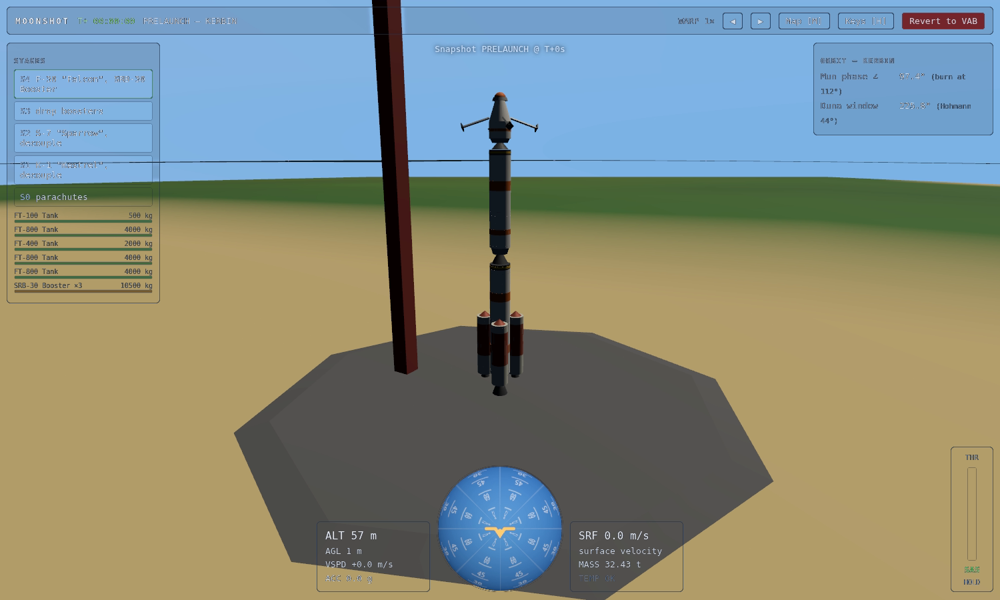
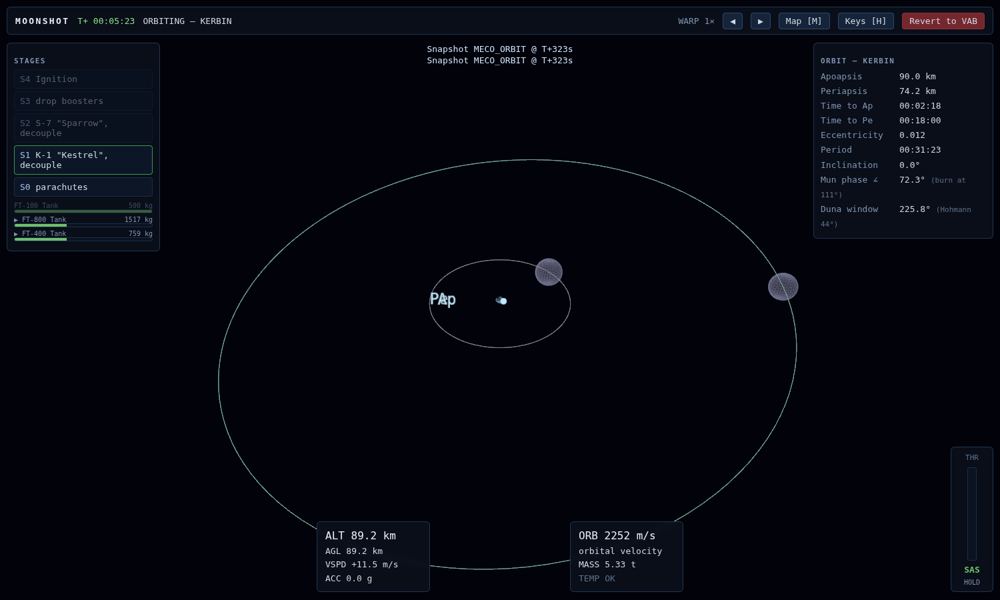
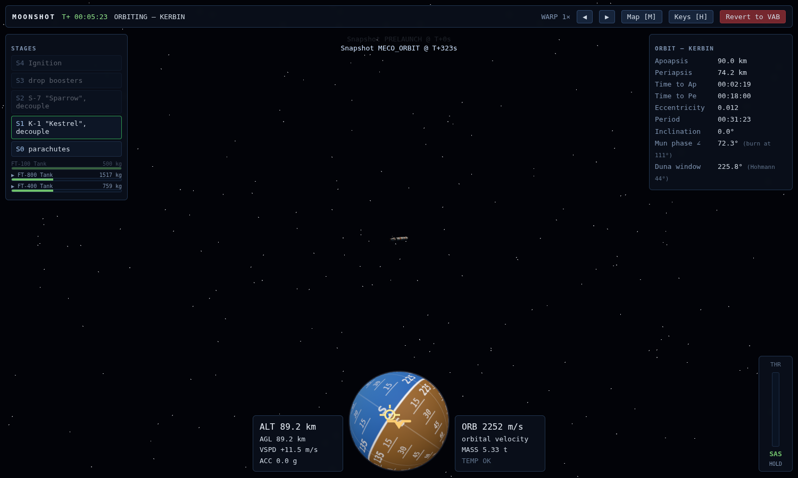

# MOONSHOT — Round-trip Flight Log

**Craft:** Mun Express (stock) · **Pilot:** autopilot (`mcp/roundtrip.mjs`) · **Physics:** live game engine, headless (`SimSession`)
**Result:** failed — CRASHED at 126.5 m/s, t=206255s, alt=5

## Events

```text
T+00:00:00   PRELAUNCH     Mun Express on the pad — liftoff mass 32.43 t, 5 stages
T+00:00:00   STAGE 1       Ignition — ignite F-30 "Falcon" + SRB-30 Booster (ignition)
T+00:00:00   LIFTOFF       Vehicle has cleared the pad
T+00:00:30   STAGE 2       Drop boosters — boosters away (SRBs dry)
T+00:01:53   STAGE 3       Decouple + ignite — ignite S-7 "Sparrow", lower stack jettisoned (stage dry)
T+00:05:23   MECO / ORBIT  Stable orbit 74 × 90 km
T+01:37:29   XFER WINDOW   Mun phase angle 110.1° (target 110.8°) — TLI burn start
T+01:38:36   TLI CUTOFF    Trans-Munar injection complete — predicted Mun periapsis 2107 km
T+09:18:36   SOI           Entered the Mun sphere of influence
T+09:52:39   MOI           Mun orbit insertion — 24 × 2107 km
T+09:52:39   MUN ORBIT     Bound Mun orbit 24 × 2107 km, period 584.3 min — beginning 3 revs
T+19:36:57   MUN ORBIT 1   Completed orbit 1/3 — 24 × 2107 km
T+29:21:13   MUN ORBIT 2   Completed orbit 2/3 — 24 × 2107 km
T+39:05:29   MUN ORBIT 3   Completed orbit 3/3 — 24 × 2107 km
T+39:05:29   TKI START     Prograde burn on Kerbin-facing side (r·R_mun=-1.37e+13)
T+40:23:40   SOI           Entered Kerbin sphere of influence
T+40:23:40   TKI CUTOFF    Escaped Mun SOI — Kerbin 5535 × 11822 km (outbound)
T+40:23:40   PE CORRECT    lowering/recapturing Kerbin Pe from 5534.9 km
T+40:23:56   RETURN COAST  Kerbin return 42 × 11049 km (Pe 42.5 km, outbound — will coast to periapsis)
T+47:57:09   CHUTES ARMED  Armed 1 parachute(s) — retrograde reentry
T+47:57:09   REENTRY       Atmospheric pass 1 — alt 94.5 km, v 3098 m/s
T+48:00:51   SKIP OUT      Pass 1 skipped out at 72.3 km, 2973 m/s — 42 × 2992 km
T+50:49:08   REENTRY       Atmospheric pass 2 — alt 91.8 km, v 2923 m/s
T+50:52:34   SKIP OUT      Pass 2 skipped out at 72.1 km, 2944 m/s — 52 × 2583 km
T+52:10:29   REENTRY       Atmospheric pass 3 — alt 89.0 km, v 2743 m/s
T+52:14:52   SKIP OUT      Pass 3 skipped out at 72.1 km, 2714 m/s — 48 × 1001 km
T+53:16:51   REENTRY       Atmospheric pass 4 — alt 88.5 km, v 2669 m/s
T+53:21:20   SKIP OUT      Pass 4 skipped out at 72.1 km, 2669 m/s — 50 × 834 km
T+54:08:53   REENTRY       Atmospheric pass 5 — alt 88.3 km, v 2569 m/s
T+54:14:26   SKIP OUT      Pass 5 skipped out at 72.1 km, 2529 m/s — 47 × 471 km
T+54:53:10   REENTRY       Atmospheric pass 6 — alt 85.1 km, v 2492 m/s
T+54:58:51   SKIP OUT      Pass 6 skipped out at 72.0 km, 2492 m/s — 52 × 390 km
T+55:34:06   REENTRY       Atmospheric pass 7 — alt 88.9 km, v 2439 m/s
T+55:40:37   SKIP OUT      Pass 7 skipped out at 72.0 km, 2445 m/s — 52 × 307 km
T+56:11:52   REENTRY       Atmospheric pass 8 — alt 89.6 km, v 2390 m/s
T+56:19:35   SKIP OUT      Pass 8 skipped out at 72.0 km, 2387 m/s — 51 × 216 km
T+56:45:50   REENTRY       Atmospheric pass 9 — alt 89.5 km, v 2330 m/s
T+56:57:28   SKIP OUT      Pass 9 skipped out at 72.0 km, 2288 m/s — 46 × 93 km
T+57:03:29   REENTRY       Atmospheric pass 10 — alt 85.8 km, v 2225 m/s
T+57:15:12   OVERHEAT      TD-12 Decoupler destroyed by heating
T+57:15:30   OVERHEAT      Mk2 Parachute destroyed by heating
T+57:17:35   CRASH         CRASHED at 126.5 m/s, t=206255s, alt=5
T+57:17:35   ABORT         CRASHED at 126.5 m/s, t=206255s, alt=5
```

## Screenshots

In-game captures from the live Three.js flight view (snapshot replay).

### Pad / prelaunch — Mun Express on the Kerbin pad



### LKO map



### LKO after MECO — stable Kerbin orbit



### TLI map (transfer + Mun encounter)


### TLI cutoff — trans-Munar coast, still Kerbin SOI


### Mun SOI map


### Mun SOI / approaching the Mun


### Mun orbit map


### Mun orbit after MOI


### Mun revs map


### After 3 Mun revolutions


### TKI map


### Kerbin return / TKI cutoff


### Return map


### Return coast / reentry (or abort state)


## Telemetry

Sampled every 15 s under thrust, every 15 min on coasts.

| MET | Body | Altitude | Velocity | Mass | Liquid fuel | Throttle | notes |
|---|---|--:|--:|--:|--:|--:|---|
| T+00:00:00 | Kerbin | 57 m | 0 m/s | 32.43 t | 14500 kg | 0% | pad |
| T+00:00:15 | Kerbin | 1.70 km | 223 m/s | 26.19 t | 13439 kg | 100% |  |
| T+00:00:30 | Kerbin | 6.79 km | 479 m/s | 19.95 t | 12378 kg | 100% |  |
| T+00:00:45 | Kerbin | 13.5 km | 456 m/s | 16.48 t | 11300 kg | 100% |  |
| T+00:01:00 | Kerbin | 20.3 km | 501 m/s | 15.40 t | 10221 kg | 100% |  |
| T+00:01:15 | Kerbin | 27.6 km | 585 m/s | 14.32 t | 9143 kg | 100% |  |
| T+00:01:30 | Kerbin | 36.1 km | 702 m/s | 13.24 t | 8064 kg | 100% |  |
| T+00:01:46 | Kerbin | 45.7 km | 851 m/s | 12.17 t | 6986 kg | 100% |  |
| T+00:02:01 | Kerbin | 56.1 km | 900 m/s | 8.90 t | 6354 kg | 100% |  |
| T+00:02:16 | Kerbin | 64.6 km | 893 m/s | 8.64 t | 6088 kg | 100% |  |
| T+00:02:31 | Kerbin | 71.3 km | 918 m/s | 8.37 t | 5822 kg | 100% |  |
| T+00:02:46 | Kerbin | 76.5 km | 970 m/s | 8.11 t | 5556 kg | 100% |  |
| T+00:03:01 | Kerbin | 80.1 km | 1050 m/s | 7.84 t | 5290 kg | 100% |  |
| T+00:03:16 | Kerbin | 82.4 km | 1150 m/s | 7.57 t | 5024 kg | 100% |  |
| T+00:03:31 | Kerbin | 83.9 km | 1258 m/s | 7.31 t | 4758 kg | 100% |  |
| T+00:03:46 | Kerbin | 84.9 km | 1369 m/s | 7.04 t | 4492 kg | 100% |  |
| T+00:04:01 | Kerbin | 85.6 km | 1485 m/s | 6.78 t | 4226 kg | 100% |  |
| T+00:04:16 | Kerbin | 86.2 km | 1605 m/s | 6.51 t | 3960 kg | 100% |  |
| T+00:04:31 | Kerbin | 86.9 km | 1732 m/s | 6.24 t | 3694 kg | 100% |  |
| T+00:04:46 | Kerbin | 87.7 km | 1870 m/s | 5.98 t | 3428 kg | 100% |  |
| T+00:05:01 | Kerbin | 88.4 km | 2020 m/s | 5.71 t | 3162 kg | 100% |  |
| T+00:05:16 | Kerbin | 89.0 km | 2178 m/s | 5.45 t | 2896 kg | 100% |  |
| T+00:05:23 | Kerbin | 89.1 km | 2252 m/s | 5.33 t | 2776 kg | 0% | LKO |
| T+00:21:29 | Kerbin | 74.8 km | 2300 m/s | 5.33 t | 2776 kg | 0% |  |
| T+00:37:29 | Kerbin | 89.6 km | 2251 m/s | 5.33 t | 2776 kg | 0% |  |
| T+00:53:29 | Kerbin | 74.5 km | 2301 m/s | 5.33 t | 2776 kg | 0% |  |
| T+01:09:29 | Kerbin | 89.8 km | 2250 m/s | 5.33 t | 2776 kg | 0% |  |
| T+01:25:29 | Kerbin | 74.3 km | 2302 m/s | 5.33 t | 2776 kg | 0% |  |
| T+01:37:29 | Kerbin | 87.2 km | 2261 m/s | 5.32 t | 2771 kg | 100% |  |
| T+01:37:44 | Kerbin | 87.5 km | 2434 m/s | 5.06 t | 2505 kg | 100% |  |
| T+01:37:59 | Kerbin | 88.2 km | 2615 m/s | 4.79 t | 2239 kg | 100% |  |
| T+01:38:14 | Kerbin | 89.4 km | 2805 m/s | 4.52 t | 1973 kg | 100% |  |
| T+01:38:29 | Kerbin | 91.7 km | 3004 m/s | 4.26 t | 1707 kg | 100% |  |
| T+01:38:36 | Kerbin | 93.2 km | 3093 m/s | 4.14 t | 1592 kg | 0% | TLI cutoff |
| T+01:54:36 | Kerbin | 1.31 Mm | 1755 m/s | 4.14 t | 1592 kg | 0% |  |
| T+02:10:36 | Kerbin | 2.47 Mm | 1295 m/s | 4.14 t | 1592 kg | 0% |  |
| T+02:26:36 | Kerbin | 3.43 Mm | 1063 m/s | 4.14 t | 1592 kg | 0% |  |
| T+02:42:36 | Kerbin | 4.26 Mm | 912 m/s | 4.14 t | 1592 kg | 0% |  |
| T+02:58:36 | Kerbin | 4.98 Mm | 803 m/s | 4.14 t | 1592 kg | 0% |  |
| T+03:14:36 | Kerbin | 5.62 Mm | 717 m/s | 4.14 t | 1592 kg | 0% |  |
| T+03:30:36 | Kerbin | 6.19 Mm | 647 m/s | 4.14 t | 1592 kg | 0% |  |
| T+03:46:36 | Kerbin | 6.70 Mm | 587 m/s | 4.14 t | 1592 kg | 0% |  |
| T+04:02:36 | Kerbin | 7.17 Mm | 536 m/s | 4.14 t | 1592 kg | 0% |  |
| T+04:18:36 | Kerbin | 7.59 Mm | 490 m/s | 4.14 t | 1592 kg | 0% |  |
| T+04:34:36 | Kerbin | 7.97 Mm | 450 m/s | 4.14 t | 1592 kg | 0% |  |
| T+04:50:36 | Kerbin | 8.31 Mm | 413 m/s | 4.14 t | 1592 kg | 0% |  |
| T+05:06:36 | Kerbin | 8.61 Mm | 380 m/s | 4.14 t | 1592 kg | 0% |  |
| T+05:22:36 | Kerbin | 8.89 Mm | 350 m/s | 4.14 t | 1592 kg | 0% |  |
| T+05:38:36 | Kerbin | 9.13 Mm | 322 m/s | 4.14 t | 1592 kg | 0% |  |
| T+05:54:36 | Kerbin | 9.34 Mm | 297 m/s | 4.14 t | 1592 kg | 0% |  |
| T+06:10:36 | Kerbin | 9.52 Mm | 275 m/s | 4.14 t | 1592 kg | 0% |  |
| T+06:26:36 | Kerbin | 9.68 Mm | 255 m/s | 4.14 t | 1592 kg | 0% |  |
| T+06:42:36 | Kerbin | 9.81 Mm | 238 m/s | 4.14 t | 1592 kg | 0% |  |
| T+06:58:36 | Kerbin | 9.91 Mm | 224 m/s | 4.14 t | 1592 kg | 0% |  |
| T+07:14:36 | Kerbin | 9.98 Mm | 212 m/s | 4.14 t | 1592 kg | 0% |  |
| T+07:30:36 | Kerbin | 10.03 Mm | 205 m/s | 4.14 t | 1592 kg | 0% |  |
| T+07:46:36 | Kerbin | 10.06 Mm | 201 m/s | 4.14 t | 1592 kg | 0% |  |
| T+08:02:36 | Kerbin | 10.06 Mm | 201 m/s | 4.14 t | 1592 kg | 0% |  |
| T+08:18:36 | Kerbin | 10.03 Mm | 205 m/s | 4.14 t | 1592 kg | 0% |  |
| T+08:34:36 | Kerbin | 9.98 Mm | 212 m/s | 4.14 t | 1592 kg | 0% |  |
| T+08:50:36 | Kerbin | 9.91 Mm | 223 m/s | 4.14 t | 1592 kg | 0% |  |
| T+09:06:36 | Kerbin | 9.81 Mm | 238 m/s | 4.14 t | 1592 kg | 0% |  |
| T+09:18:36 | the Mun | 2.22 Mm | 398 m/s | 4.14 t | 1592 kg | 0% | Mun SOI |
| T+09:34:36 | the Mun | 2.14 Mm | 400 m/s | 4.14 t | 1592 kg | 0% |  |
| T+09:50:36 | the Mun | 2.11 Mm | 401 m/s | 4.14 t | 1592 kg | 0% |  |
| T+09:52:18 | the Mun | 2.11 Mm | 398 m/s | 4.14 t | 1588 kg | 100% |  |
| T+09:52:33 | the Mun | 2.11 Mm | 173 m/s | 3.87 t | 1322 kg | 100% |  |
| T+09:52:39 | the Mun | 2.11 Mm | 71 m/s | 3.76 t | 1206 kg | 0% | Mun orbit 24 × 2107 km |
| T+10:08:39 | the Mun | 2.10 Mm | 72 m/s | 3.76 t | 1206 kg | 0% |  |
| T+10:24:39 | the Mun | 2.09 Mm | 74 m/s | 3.76 t | 1206 kg | 0% |  |
| T+10:40:39 | the Mun | 2.06 Mm | 78 m/s | 3.76 t | 1206 kg | 0% |  |
| T+10:56:39 | the Mun | 2.03 Mm | 83 m/s | 3.76 t | 1206 kg | 0% |  |
| T+11:12:39 | the Mun | 1.99 Mm | 90 m/s | 3.76 t | 1206 kg | 0% |  |
| T+11:28:39 | the Mun | 1.94 Mm | 98 m/s | 3.76 t | 1206 kg | 0% |  |
| T+11:44:39 | the Mun | 1.87 Mm | 107 m/s | 3.76 t | 1206 kg | 0% |  |
| T+12:00:39 | the Mun | 1.80 Mm | 117 m/s | 3.76 t | 1206 kg | 0% |  |
| T+12:16:39 | the Mun | 1.71 Mm | 129 m/s | 3.76 t | 1206 kg | 0% |  |
| T+12:32:39 | the Mun | 1.61 Mm | 143 m/s | 3.76 t | 1206 kg | 0% |  |
| T+12:48:39 | the Mun | 1.50 Mm | 159 m/s | 3.76 t | 1206 kg | 0% |  |
| T+13:04:39 | the Mun | 1.37 Mm | 178 m/s | 3.76 t | 1206 kg | 0% |  |
| T+13:20:39 | the Mun | 1.22 Mm | 201 m/s | 3.76 t | 1206 kg | 0% |  |
| T+13:36:39 | the Mun | 1.05 Mm | 230 m/s | 3.76 t | 1206 kg | 0% |  |
| T+13:52:39 | the Mun | 851.2 km | 269 m/s | 3.76 t | 1206 kg | 0% |  |
| T+14:08:39 | the Mun | 621.7 km | 327 m/s | 3.76 t | 1206 kg | 0% |  |
| T+14:24:39 | the Mun | 347.5 km | 432 m/s | 3.76 t | 1206 kg | 0% |  |
| T+14:40:39 | the Mun | 51.0 km | 684 m/s | 3.76 t | 1206 kg | 0% |  |
| T+14:56:39 | the Mun | 196.6 km | 526 m/s | 3.76 t | 1206 kg | 0% |  |
| T+15:12:39 | the Mun | 494.5 km | 369 m/s | 3.76 t | 1206 kg | 0% |  |
| T+15:28:39 | the Mun | 744.2 km | 294 m/s | 3.76 t | 1206 kg | 0% |  |
| T+15:44:39 | the Mun | 955.3 km | 248 m/s | 3.76 t | 1206 kg | 0% |  |
| T+16:00:39 | the Mun | 1.14 Mm | 214 m/s | 3.76 t | 1206 kg | 0% |  |
| T+16:16:39 | the Mun | 1.30 Mm | 189 m/s | 3.76 t | 1206 kg | 0% |  |
| T+16:32:39 | the Mun | 1.43 Mm | 168 m/s | 3.76 t | 1206 kg | 0% |  |
| T+16:48:39 | the Mun | 1.56 Mm | 151 m/s | 3.76 t | 1206 kg | 0% |  |
| T+17:04:39 | the Mun | 1.66 Mm | 136 m/s | 3.76 t | 1206 kg | 0% |  |
| T+17:20:39 | the Mun | 1.76 Mm | 123 m/s | 3.76 t | 1206 kg | 0% |  |
| T+17:36:39 | the Mun | 1.84 Mm | 112 m/s | 3.76 t | 1206 kg | 0% |  |
| T+17:52:39 | the Mun | 1.91 Mm | 102 m/s | 3.76 t | 1206 kg | 0% |  |
| T+18:08:39 | the Mun | 1.96 Mm | 93 m/s | 3.76 t | 1206 kg | 0% |  |
| T+18:24:45 | the Mun | 2.01 Mm | 86 m/s | 3.76 t | 1206 kg | 0% |  |
| T+18:40:45 | the Mun | 2.05 Mm | 80 m/s | 3.76 t | 1206 kg | 0% |  |
| T+18:56:45 | the Mun | 2.08 Mm | 76 m/s | 3.76 t | 1206 kg | 0% |  |
| T+19:12:45 | the Mun | 2.10 Mm | 72 m/s | 3.76 t | 1206 kg | 0% |  |
| T+19:28:45 | the Mun | 2.11 Mm | 71 m/s | 3.76 t | 1206 kg | 0% |  |
| T+19:36:57 | the Mun | 2.11 Mm | 71 m/s | 3.76 t | 1206 kg | 0% | Mun rev 1 |
| T+19:52:57 | the Mun | 2.10 Mm | 72 m/s | 3.76 t | 1206 kg | 0% |  |
| T+20:08:57 | the Mun | 2.09 Mm | 74 m/s | 3.76 t | 1206 kg | 0% |  |
| T+20:24:57 | the Mun | 2.06 Mm | 78 m/s | 3.76 t | 1206 kg | 0% |  |
| T+20:40:57 | the Mun | 2.03 Mm | 83 m/s | 3.76 t | 1206 kg | 0% |  |
| T+20:56:57 | the Mun | 1.99 Mm | 90 m/s | 3.76 t | 1206 kg | 0% |  |
| T+21:12:57 | the Mun | 1.94 Mm | 98 m/s | 3.76 t | 1206 kg | 0% |  |
| T+21:28:57 | the Mun | 1.87 Mm | 107 m/s | 3.76 t | 1206 kg | 0% |  |
| T+21:44:57 | the Mun | 1.80 Mm | 117 m/s | 3.76 t | 1206 kg | 0% |  |
| T+22:00:57 | the Mun | 1.71 Mm | 129 m/s | 3.76 t | 1206 kg | 0% |  |
| T+22:16:57 | the Mun | 1.61 Mm | 143 m/s | 3.76 t | 1206 kg | 0% |  |
| T+22:32:57 | the Mun | 1.50 Mm | 159 m/s | 3.76 t | 1206 kg | 0% |  |
| T+22:48:57 | the Mun | 1.36 Mm | 178 m/s | 3.76 t | 1206 kg | 0% |  |
| T+23:04:57 | the Mun | 1.22 Mm | 201 m/s | 3.76 t | 1206 kg | 0% |  |
| T+23:20:57 | the Mun | 1.05 Mm | 230 m/s | 3.76 t | 1206 kg | 0% |  |
| T+23:36:57 | the Mun | 850.7 km | 269 m/s | 3.76 t | 1206 kg | 0% |  |
| T+23:52:57 | the Mun | 621.1 km | 327 m/s | 3.76 t | 1206 kg | 0% |  |
| T+24:08:57 | the Mun | 346.8 km | 432 m/s | 3.76 t | 1206 kg | 0% |  |
| T+24:24:57 | the Mun | 50.5 km | 685 m/s | 3.76 t | 1206 kg | 0% |  |
| T+24:40:57 | the Mun | 197.3 km | 526 m/s | 3.76 t | 1206 kg | 0% |  |
| T+24:56:57 | the Mun | 495.2 km | 369 m/s | 3.76 t | 1206 kg | 0% |  |
| T+25:12:57 | the Mun | 744.8 km | 294 m/s | 3.76 t | 1206 kg | 0% |  |
| T+25:28:57 | the Mun | 955.8 km | 247 m/s | 3.76 t | 1206 kg | 0% |  |
| T+25:44:57 | the Mun | 1.14 Mm | 214 m/s | 3.76 t | 1206 kg | 0% |  |
| T+26:00:57 | the Mun | 1.30 Mm | 189 m/s | 3.76 t | 1206 kg | 0% |  |
| T+26:16:57 | the Mun | 1.43 Mm | 168 m/s | 3.76 t | 1206 kg | 0% |  |
| T+26:32:57 | the Mun | 1.56 Mm | 151 m/s | 3.76 t | 1206 kg | 0% |  |
| T+26:48:57 | the Mun | 1.66 Mm | 136 m/s | 3.76 t | 1206 kg | 0% |  |
| T+27:04:57 | the Mun | 1.76 Mm | 123 m/s | 3.76 t | 1206 kg | 0% |  |
| T+27:20:57 | the Mun | 1.84 Mm | 112 m/s | 3.76 t | 1206 kg | 0% |  |
| T+27:36:57 | the Mun | 1.91 Mm | 102 m/s | 3.76 t | 1206 kg | 0% |  |
| T+27:52:57 | the Mun | 1.96 Mm | 93 m/s | 3.76 t | 1206 kg | 0% |  |
| T+28:08:57 | the Mun | 2.01 Mm | 86 m/s | 3.76 t | 1206 kg | 0% |  |
| T+28:24:57 | the Mun | 2.05 Mm | 80 m/s | 3.76 t | 1206 kg | 0% |  |
| T+28:40:57 | the Mun | 2.08 Mm | 76 m/s | 3.76 t | 1206 kg | 0% |  |
| T+28:56:57 | the Mun | 2.10 Mm | 72 m/s | 3.76 t | 1206 kg | 0% |  |
| T+29:12:57 | the Mun | 2.11 Mm | 71 m/s | 3.76 t | 1206 kg | 0% |  |
| T+29:21:13 | the Mun | 2.11 Mm | 71 m/s | 3.76 t | 1206 kg | 0% | Mun rev 2 |
| T+29:37:13 | the Mun | 2.10 Mm | 72 m/s | 3.76 t | 1206 kg | 0% |  |
| T+29:53:13 | the Mun | 2.09 Mm | 74 m/s | 3.76 t | 1206 kg | 0% |  |
| T+30:09:13 | the Mun | 2.06 Mm | 78 m/s | 3.76 t | 1206 kg | 0% |  |
| T+30:25:13 | the Mun | 2.03 Mm | 83 m/s | 3.76 t | 1206 kg | 0% |  |
| T+30:41:13 | the Mun | 1.99 Mm | 90 m/s | 3.76 t | 1206 kg | 0% |  |
| T+30:57:13 | the Mun | 1.94 Mm | 98 m/s | 3.76 t | 1206 kg | 0% |  |
| T+31:13:13 | the Mun | 1.87 Mm | 107 m/s | 3.76 t | 1206 kg | 0% |  |
| T+31:29:13 | the Mun | 1.80 Mm | 117 m/s | 3.76 t | 1206 kg | 0% |  |
| T+31:45:13 | the Mun | 1.71 Mm | 129 m/s | 3.76 t | 1206 kg | 0% |  |
| T+32:01:13 | the Mun | 1.61 Mm | 143 m/s | 3.76 t | 1206 kg | 0% |  |
| T+32:17:13 | the Mun | 1.50 Mm | 159 m/s | 3.76 t | 1206 kg | 0% |  |
| T+32:33:13 | the Mun | 1.36 Mm | 178 m/s | 3.76 t | 1206 kg | 0% |  |
| T+32:49:13 | the Mun | 1.22 Mm | 201 m/s | 3.76 t | 1206 kg | 0% |  |
| T+33:05:13 | the Mun | 1.05 Mm | 230 m/s | 3.76 t | 1206 kg | 0% |  |
| T+33:21:13 | the Mun | 850.7 km | 269 m/s | 3.76 t | 1206 kg | 0% |  |
| T+33:37:13 | the Mun | 621.1 km | 327 m/s | 3.76 t | 1206 kg | 0% |  |
| T+33:53:13 | the Mun | 346.8 km | 432 m/s | 3.76 t | 1206 kg | 0% |  |
| T+34:09:13 | the Mun | 50.5 km | 685 m/s | 3.76 t | 1206 kg | 0% |  |
| T+34:25:13 | the Mun | 197.3 km | 526 m/s | 3.76 t | 1206 kg | 0% |  |
| T+34:41:13 | the Mun | 495.2 km | 369 m/s | 3.76 t | 1206 kg | 0% |  |
| T+34:57:13 | the Mun | 744.8 km | 294 m/s | 3.76 t | 1206 kg | 0% |  |
| T+35:13:13 | the Mun | 955.8 km | 247 m/s | 3.76 t | 1206 kg | 0% |  |
| T+35:29:13 | the Mun | 1.14 Mm | 214 m/s | 3.76 t | 1206 kg | 0% |  |
| T+35:45:13 | the Mun | 1.30 Mm | 189 m/s | 3.76 t | 1206 kg | 0% |  |
| T+36:01:13 | the Mun | 1.43 Mm | 168 m/s | 3.76 t | 1206 kg | 0% |  |
| T+36:17:13 | the Mun | 1.56 Mm | 151 m/s | 3.76 t | 1206 kg | 0% |  |
| T+36:33:13 | the Mun | 1.66 Mm | 136 m/s | 3.76 t | 1206 kg | 0% |  |
| T+36:49:13 | the Mun | 1.76 Mm | 123 m/s | 3.76 t | 1206 kg | 0% |  |
| T+37:05:13 | the Mun | 1.84 Mm | 112 m/s | 3.76 t | 1206 kg | 0% |  |
| T+37:21:13 | the Mun | 1.91 Mm | 102 m/s | 3.76 t | 1206 kg | 0% |  |
| T+37:37:13 | the Mun | 1.96 Mm | 93 m/s | 3.76 t | 1206 kg | 0% |  |
| T+37:53:13 | the Mun | 2.01 Mm | 86 m/s | 3.76 t | 1206 kg | 0% |  |
| T+38:09:13 | the Mun | 2.05 Mm | 80 m/s | 3.76 t | 1206 kg | 0% |  |
| T+38:25:13 | the Mun | 2.08 Mm | 76 m/s | 3.76 t | 1206 kg | 0% |  |
| T+38:41:13 | the Mun | 2.10 Mm | 72 m/s | 3.76 t | 1206 kg | 0% |  |
| T+38:57:13 | the Mun | 2.11 Mm | 71 m/s | 3.76 t | 1206 kg | 0% |  |
| T+39:05:29 | the Mun | 2.11 Mm | 71 m/s | 3.76 t | 1206 kg | 0% | Mun rev 3 |
| T+39:05:29 | the Mun | 2.11 Mm | 71 m/s | 3.76 t | 1206 kg | 0% | TKI start |
| T+39:21:40 | the Mun | 2.11 Mm | 238 m/s | 3.57 t | 1025 kg | 0% |  |
| T+39:37:40 | the Mun | 2.13 Mm | 237 m/s | 3.57 t | 1025 kg | 0% |  |
| T+39:53:40 | the Mun | 2.16 Mm | 236 m/s | 3.57 t | 1025 kg | 0% |  |
| T+40:09:40 | the Mun | 2.19 Mm | 234 m/s | 3.57 t | 1025 kg | 0% |  |
| T+40:23:40 | Kerbin | 11.01 Mm | 477 m/s | 3.57 t | 1025 kg | 0% | TKI cutoff |
| T+40:23:55 | Kerbin | 11.01 Mm | 212 m/s | 3.31 t | 755 kg | 100% |  |
| T+40:23:56 | Kerbin | 11.01 Mm | 184 m/s | 3.28 t | 728 kg | 0% | return coast |
| T+40:39:56 | Kerbin | 11.04 Mm | 179 m/s | 3.28 t | 728 kg | 0% |  |
| T+40:55:56 | Kerbin | 11.05 Mm | 178 m/s | 3.28 t | 728 kg | 0% |  |
| T+41:11:56 | Kerbin | 11.04 Mm | 180 m/s | 3.28 t | 728 kg | 0% |  |
| T+41:27:56 | Kerbin | 11.00 Mm | 185 m/s | 3.28 t | 728 kg | 0% |  |
| T+41:43:56 | Kerbin | 10.95 Mm | 193 m/s | 3.28 t | 728 kg | 0% |  |
| T+41:59:56 | Kerbin | 10.87 Mm | 203 m/s | 3.28 t | 728 kg | 0% |  |
| T+42:15:56 | Kerbin | 10.77 Mm | 216 m/s | 3.28 t | 728 kg | 0% |  |
| T+42:31:56 | Kerbin | 10.65 Mm | 231 m/s | 3.28 t | 728 kg | 0% |  |
| T+42:47:56 | Kerbin | 10.50 Mm | 248 m/s | 3.28 t | 728 kg | 0% |  |
| T+43:03:56 | Kerbin | 10.33 Mm | 267 m/s | 3.28 t | 728 kg | 0% |  |
| T+43:19:56 | Kerbin | 10.14 Mm | 288 m/s | 3.28 t | 728 kg | 0% |  |
| T+43:35:56 | Kerbin | 9.92 Mm | 311 m/s | 3.28 t | 728 kg | 0% |  |
| T+43:51:56 | Kerbin | 9.68 Mm | 335 m/s | 3.28 t | 728 kg | 0% |  |
| T+44:07:56 | Kerbin | 9.41 Mm | 362 m/s | 3.28 t | 728 kg | 0% |  |
| T+44:23:56 | Kerbin | 9.11 Mm | 391 m/s | 3.28 t | 728 kg | 0% |  |
| T+44:39:56 | Kerbin | 8.78 Mm | 422 m/s | 3.28 t | 728 kg | 0% |  |
| T+44:55:56 | Kerbin | 8.42 Mm | 457 m/s | 3.28 t | 728 kg | 0% |  |
| T+45:11:56 | Kerbin | 8.02 Mm | 495 m/s | 3.28 t | 728 kg | 0% |  |
| T+45:27:56 | Kerbin | 7.59 Mm | 537 m/s | 3.28 t | 728 kg | 0% |  |
| T+45:43:56 | Kerbin | 7.11 Mm | 584 m/s | 3.28 t | 728 kg | 0% |  |
| T+45:59:56 | Kerbin | 6.59 Mm | 639 m/s | 3.28 t | 728 kg | 0% |  |
| T+46:15:56 | Kerbin | 6.01 Mm | 702 m/s | 3.28 t | 728 kg | 0% |  |
| T+46:31:56 | Kerbin | 5.38 Mm | 779 m/s | 3.28 t | 728 kg | 0% |  |
| T+46:47:56 | Kerbin | 4.67 Mm | 875 m/s | 3.28 t | 728 kg | 0% |  |
| T+47:03:56 | Kerbin | 3.87 Mm | 1003 m/s | 3.28 t | 728 kg | 0% |  |
| T+47:19:56 | Kerbin | 2.95 Mm | 1189 m/s | 3.28 t | 728 kg | 0% |  |
| T+47:35:56 | Kerbin | 1.86 Mm | 1516 m/s | 3.28 t | 728 kg | 0% |  |
| T+47:51:56 | Kerbin | 502.5 km | 2415 m/s | 3.28 t | 728 kg | 0% |  |
| T+47:57:09 | Kerbin | 94.5 km | 3098 m/s | 3.28 t | 728 kg | 0% | atmo approach |
| T+48:12:51 | Kerbin | 891.2 km | 1752 m/s | 3.28 t | 728 kg | 0% |  |
| T+48:28:51 | Kerbin | 1.81 Mm | 1124 m/s | 3.28 t | 728 kg | 0% |  |
| T+48:44:51 | Kerbin | 2.42 Mm | 821 m/s | 3.28 t | 728 kg | 0% |  |
| T+49:00:51 | Kerbin | 2.79 Mm | 645 m/s | 3.28 t | 728 kg | 0% |  |
| T+49:16:51 | Kerbin | 2.97 Mm | 557 m/s | 3.28 t | 728 kg | 0% |  |
| T+49:24:52 | Kerbin | 2.99 Mm | 548 m/s | 3.28 t | 726 kg | 100% |  |
| T+49:40:52 | Kerbin | 2.91 Mm | 592 m/s | 3.27 t | 724 kg | 0% |  |
| T+49:56:52 | Kerbin | 2.64 Mm | 720 m/s | 3.27 t | 724 kg | 0% |  |
| T+50:12:52 | Kerbin | 2.16 Mm | 946 m/s | 3.27 t | 724 kg | 0% |  |
| T+50:28:52 | Kerbin | 1.42 Mm | 1352 m/s | 3.27 t | 724 kg | 0% |  |
| T+50:43:52 | Kerbin | 420.5 km | 2293 m/s | 3.27 t | 724 kg | 0% |  |
| T+50:52:34 | Kerbin | 72.2 km | 2941 m/s | 3.27 t | 721 kg | 100% |  |
| T+51:08:42 | Kerbin | 875.8 km | 1435 m/s | 3.13 t | 578 kg | 0% |  |
| T+51:24:42 | Kerbin | 1.30 Mm | 996 m/s | 3.13 t | 578 kg | 0% |  |
| T+51:40:42 | Kerbin | 1.28 Mm | 1019 m/s | 3.13 t | 578 kg | 0% |  |
| T+51:56:42 | Kerbin | 798.3 km | 1525 m/s | 3.13 t | 578 kg | 0% |  |
| T+52:11:43 | Kerbin | 58.1 km | 2828 m/s | 3.13 t | 578 kg | 0% |  |
| T+52:26:52 | Kerbin | 604.9 km | 1649 m/s | 3.13 t | 578 kg | 0% |  |
| T+52:42:52 | Kerbin | 989.7 km | 1141 m/s | 3.13 t | 578 kg | 0% |  |
| T+52:45:57 | Kerbin | 1.00 Mm | 1129 m/s | 3.13 t | 576 kg | 100% |  |
| T+53:01:57 | Kerbin | 733.2 km | 1470 m/s | 3.13 t | 576 kg | 0% |  |
| T+53:16:57 | Kerbin | 85.5 km | 2677 m/s | 3.13 t | 576 kg | 0% |  |
| T+53:21:21 | Kerbin | 72.1 km | 2666 m/s | 3.12 t | 573 kg | 100% |  |
| T+53:37:23 | Kerbin | 597.1 km | 1495 m/s | 3.08 t | 528 kg | 0% |  |
| T+53:53:23 | Kerbin | 600.2 km | 1490 m/s | 3.08 t | 528 kg | 0% |  |
| T+54:08:23 | Kerbin | 102.0 km | 2529 m/s | 3.08 t | 528 kg | 0% |  |
| T+54:24:26 | Kerbin | 349.4 km | 1824 m/s | 3.08 t | 528 kg | 0% |  |
| T+54:33:55 | Kerbin | 470.6 km | 1579 m/s | 3.08 t | 526 kg | 100% |  |
| T+54:48:55 | Kerbin | 198.9 km | 2178 m/s | 3.07 t | 524 kg | 0% |  |
| T+55:04:51 | Kerbin | 210.3 km | 2101 m/s | 3.07 t | 524 kg | 0% |  |
| T+55:20:51 | Kerbin | 369.6 km | 1727 m/s | 3.07 t | 524 kg | 0% |  |
| T+55:35:51 | Kerbin | 62.3 km | 2521 m/s | 3.07 t | 524 kg | 0% |  |
| T+55:52:37 | Kerbin | 284.6 km | 1858 m/s | 3.07 t | 524 kg | 0% |  |
| T+56:08:37 | Kerbin | 153.6 km | 2200 m/s | 3.07 t | 524 kg | 0% |  |
| T+56:25:35 | Kerbin | 155.9 km | 2128 m/s | 3.07 t | 524 kg | 0% |  |
| T+56:41:35 | Kerbin | 151.4 km | 2142 m/s | 3.07 t | 524 kg | 0% |  |
| T+56:56:35 | Kerbin | 67.8 km | 2302 m/s | 3.07 t | 524 kg | 0% |  |
| T+56:57:28 | Kerbin | 72.0 km | 2286 m/s | 3.07 t | 523 kg | 100% |  |
| T+57:12:28 | Kerbin | 49.4 km | 2327 m/s | 3.06 t | 510 kg | 0% |  |
| T+57:16:16 | Kerbin | 14.9 km | 892 m/s | 2.91 t | 507 kg | 100% |  |
| T+57:16:31 | Kerbin | 11.3 km | 369 m/s | 2.64 t | 237 kg | 100% |  |
| T+57:16:46 | Kerbin | 8.25 km | 281 m/s | 2.60 t | 198 kg | 100% |  |
| T+57:17:02 | Kerbin | 4.80 km | 216 m/s | 2.57 t | 173 kg | 100% |  |
| T+57:17:18 | Kerbin | 2.12 km | 150 m/s | 2.50 t | 102 kg | 100% |  |
